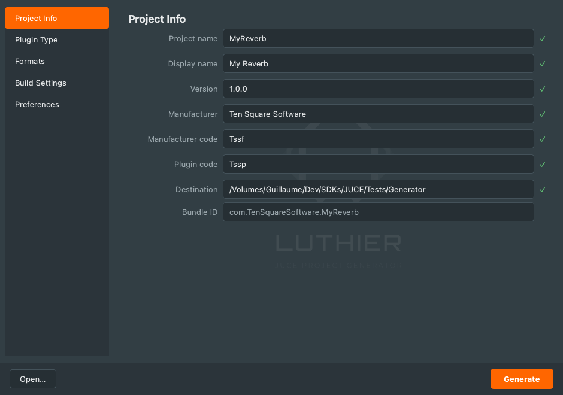

# Luthier

A Projucer-inspired desktop GUI for creating, reopening, and configuring CMake-based JUCE audio plugin projects.



Luthier is a [PySide6](https://doc.qt.io/qtforpython/) front-end for a JUCE plugin **project generator**: fill a form, validate inline, and generate a ready-to-build CMake project (AU / VST3 / Standalone). It can also reopen an existing generated project to tweak and regenerate it, and stores your defaults (manufacturer, codes, paths, build settings) in a persistent preferences file — no more hand-editing configuration scripts.

## Features

- **Project Info** — technical/display names, version, manufacturer, plugin & manufacturer codes, auto-computed bundle ID, with live inline validation.
- **Plugin Type** — Synthesizer, Audio Effect, or MIDI Effect (drives JUCE's `IS_SYNTH` / `IS_MIDI_EFFECT`, MIDI I/O, and AU/VST3 categories).
- **Formats** — AU, VST3, Standalone.
- **Build Settings** — copy to system plugin folders and/or a central artefacts directory (per OS).
- **Preferences** — persistent defaults stored as JSON in the OS configuration directory, replacing manual edits to the generator's configuration.
- **Reopen a project** — read an existing generated project back into the form and regenerate it in place.

## Requirements

- Python 3.11+
- PySide6 (`pip install -r requirements.txt`)
- A JUCE plugin project generator (the CMake templates Luthier drives). Luthier wraps a separate Python generator; in development it expects it at a configurable path (see `core/generator_bridge.py`), and packaged builds bundle a copy.

## Run from source

```bash
python -m venv .venv
.venv/bin/pip install -r requirements.txt
.venv/bin/python main.py
```

Check that the generator is reachable (headless):

```bash
.venv/bin/python main.py --check
```

## Build a standalone app

PyInstaller bundles the generator, its templates, and the resources into a
self-contained app. It does not cross-compile — build on each target OS.

```bash
.venv/bin/pip install -r requirements-dev.txt
.venv/bin/pyinstaller build/luthier.spec --noconfirm --distpath dist --workpath build
```

The same `build/luthier.spec` works on all platforms:

| OS      | Output                       |
| ------- | ---------------------------- |
| macOS   | `dist/Luthier.app`           |
| Windows | `dist/Luthier/Luthier.exe`   |
| Linux   | `dist/Luthier/Luthier`       |

On Windows, activate the virtual environment with `.venv\Scripts\activate` and
run `pyinstaller build\luthier.spec`.

## License

Luthier is released under the [MIT License](LICENSE).

Packaged builds are distributed with Qt (via PySide6) under the LGPLv3 — see [THIRD-PARTY-NOTICES.md](THIRD-PARTY-NOTICES.md).
