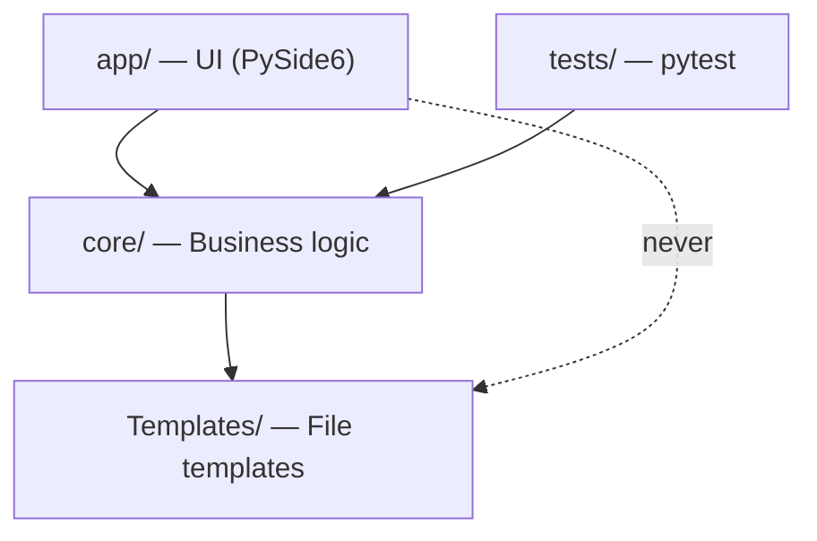

# Architecture Spine — Luthier

## Design Paradigm

**Strict layered architecture** with a typed central model.

Three layers; dependencies flow downward only — `app/` → `core/` → `Templates/`. `core/` never imports from `app/`. `Templates/` is data, not code.

The **`ProjectSpec` dataclass** (`core/project_spec.py`) is the sole cross-layer contract: every layer that produces or consumes project data speaks `ProjectSpec`, never a raw `dict`.



## Invariants & Rules

### AD-1 — ProjectSpec as the cross-layer contract

- **Binds:** all layers
- **Prevents:** key-mismatch bugs and silent failures from untyped dicts flowing across layer boundaries
- **Rule:** no layer passes a raw `dict` of project data across a layer boundary. `ProjectPage` exposes `spec() -> ProjectSpec`; `ProjectGenerator.generate()` accepts `ProjectSpec`. Fields use `snake_case` (Python); CMake template placeholders use `camelCase` (CMake convention). [ADOPTED — revised Epic 9]

### AD-2 — ProjectSpec is the single data model

- **Binds:** `ProjectPage`, `ProjectGenerator`, `ProjectWriter`, `Preferences`
- **Prevents:** the two-dict split (`values` + `config`) that forced callers to assemble project data from two incompatible halves
- **Rule:** `ProjectSpec` carries both identity fields (plugin name, type, formats…) and artefact config fields (copy flags, per-OS paths), **including per-OS workspace paths**. A new project seeds from `preferences.json`. `ProjectPage.spec()` replaces `values()` + `config()`. [ADOPTED — revised Epic 9]

### AD-3 — Write-only sidecar `.luthier.json` (Epic 9)

- **Binds:** `ProjectWriter`
- **Prevents:** false expectation of round-trip reload; competing deserialisers diverging over time
- **Rule:** `ProjectWriter` writes `.luthier.json` (full `ProjectSpec` serialised as JSON, **without `accentColor`**) alongside `CMakeLists.txt` at generation time. **No module reads `.luthier.json` at runtime.** Sidecar is reference metadata for humans and AI tools. Epic 2 (Reliable Project Reload) is **superseded**. [ADOPTED — revised Epic 9]

### AD-4 — Atomic project write

- **Binds:** `ProjectWriter`
- **Prevents:** a half-written, corrupted project directory when generation fails mid-way
- **Rule:** `ProjectWriter.write()` writes to a sibling temp directory (`<name>.tmp/`) then renames atomically to the final path — replacing an **empty** existing directory if present. On error, the temp directory is cleaned up and the original is left untouched. Generate is **hard-blocked** when the target project directory exists and is non-empty (`destination_blocks_generate()` in `core/project_generator.py`; UI shows `QMessageBox.warning` before calling `generate()`), **except** a **session-only carve-out** (Story 9.8): same path as last successful Generate this session + user confirms destructive replace via `confirm_yes_no`; core accepts explicit `allow_overwrite=True` only after that confirm. Post-session or unknown non-empty folders remain hard-blocked. [ADOPTED — revised Epic 9.2 + 9.8, 2026-07-04]

### AD-5 — Preferences persistence is Preferences-driven only; save is app-layer only

- **Binds:** `MainWindow`, `PreferencesPage`, `Preferences`
- **Prevents:** global defaults being overwritten by project-specific state; `core/` acquiring hidden app-layer side-effects
- **Rule:** `preferences.json` is written **only** by: (1) first-launch factory file creation, (2) Preferences tab auto-save on valid edit, (3) successful Import Preferences. `MainWindow` calls `prefs.save()` only after auto-save or import — **never** after Generate Project. Generate must not call `Preferences.update(ProjectSpec)`. `core/` never calls `prefs.save()` directly. [ADOPTED — revised 2026-06-25, supersedes Epic 1 Story 1.3 AD-5 AC]

### AD-6 — Test strategy: pytest, two tiers, no Qt

- **Binds:** `tests/`
- **Prevents:** untested pure functions and fragile regex going undetected
- **Rule:** `tests/unit/` covers every public `core/` function with no Qt dependency (pure functions, no I/O). `tests/integration/` covers the full `ProjectSpec → write → sidecar` generation path using pytest's `tmp_path` fixture. No Qt widget tests. pytest is a dev-only dependency (`requirements-dev.txt`). [ADOPTED — revised Epic 9]

### AD-7 — `juce_dir` is a ProjectSpec field; Preferences holds the default seed only

- **Binds:** `ProjectSpec`, `Preferences`, `render_context`, `ProjectWriter`
- **Prevents:** per-project JUCE version pinning being lost on regenerate; environment default conflated with project configuration
- **Rule:** `ProjectSpec` includes six per-OS workspace keys (`destinationDir*`, `juceDir*`). They are written to `.luthier.json` (write-only sidecar). `render_context.build_context(spec)` reads workspace paths from `ProjectSpec` — no separate parameter. `Preferences` workspace keys are the **default seed** only: copied into new Project forms at startup and Create New Project, not read at Generate time. [ADOPTED — revised Epic 9]

### AD-8 — Dependency direction is enforced by import discipline

- **Binds:** all modules
- **Prevents:** a core module importing a Qt widget, collapsing the layer boundary and making core untestable without a display
- **Rule:** no module under `core/` imports from `app/`. Violations are caught by any test runner (import of `core/` must not trigger a Qt import). `Preferences` lives in `core/` and carries no Qt dependency. [ADOPTED]

### AD-9 — User template overrides are resolved at write time, not stored in ProjectSpec

- **Binds:** `ProjectWriter`, `templates_store`, `ProjectSpec`
- **Prevents:** two incompatible representations of template selection (stored ID vs. resolved Path) diverging across modules
- **Rule:** `ProjectSpec` carries no reference to user template overrides. `ProjectWriter` resolves overrides at write time via `templates_store.overrides_dir()` — a `Path` injected at construction. The override lookup is `ProjectWriter`'s responsibility alone; no other module resolves or stores it. [ADOPTED]

### AD-10 — Atomic JSON persistence for app config

- **Binds:** `Preferences`, `AppState`
- **Prevents:** truncated or corrupt `preferences.json` / `app_state.json` after crash mid-write; silent recovery from corrupt config
- **Rule:** config JSON files are written via a sibling temp file then atomically replaced — same commit semantics as AD-4. On read failure, fall back to in-memory defaults and notify the user via the app layer; never silently pretend a corrupt file loaded successfully. [ADOPTED — Epic 7.2, 2026-06-28]

## Consistency Conventions

| Concern | Convention |
|---|---|
| Python identifiers | `snake_case` for functions, variables, fields; `PascalCase` for classes |
| CMake template keys | `camelCase` (`{projectName}`, `{cxxStandard}`, …) |
| CMake literal braces | Doubled: `${{VAR}}` in `str.format` templates |
| Token placeholders (C++ sources) | `@KEY@` form only; files remain valid C++ without substitution |
| File encoding | `encoding="utf-8"` on every `open()` / `read_text()` / `write_text()` |
| OS paths | `QStandardPaths` only; never hardcode `~/Library` or platform paths |
| Error propagation | `core/` raises standard Python exceptions (no custom hierarchy yet); `MainWindow` is the single catch boundary for user-visible errors; bare `except Exception` is acceptable only in `MainWindow` action handlers |
| Comments | Only for non-obvious *why* (hidden constraint, workaround, subtle invariant); never document *what* |

## Stack

| Name | Version |
|---|---|
| Python | 3.14 (cp310-abi3 ABI wheel) |
| PySide6 | ≥ 6.7 |
| Qt style | Fusion + custom QSS (`app/theme.py`) |
| pytest | latest (dev only) |
| PyInstaller | ≥ 6.0 (dev/packaging only) |

## Structural Seed

```text
Luthier/
  main.py                      # entry point: QApplication + MainWindow
  core/
    project_spec.py            # ProjectSpec dataclass — the cross-layer contract  ← NEW
    project_generator.py       # orchestrates generation; accepts ProjectSpec
    project_writer.py          # atomic write + .luthier.json sidecar (write-only)
    render_context.py          # ProjectSpec → template context dict
    preferences.py             # Preferences — juce_dir default seed; ProjectSpec carries per-project juce_dir
    plugin_settings.py         # pure: flags, bundle_id, categories
    validation.py              # pure: field validators → (bool, str)
    rendering.py               # render() [str.format] + render_tokens() [@KEY@]
    templates_store.py         # read/write/reset user source template overrides
  app/
    main_window.py             # QMainWindow: tab bar, stack, generate actions
    theme.py                   # Palette + build_stylesheet() — single QSS source
    pages/                     # one file per tab/section; emit validityChanged
    widgets/                   # reusable field widgets (ValidatedField, ComboField…)
  tests/
    unit/                      # pure core/ functions — no I/O, no Qt
    integration/               # ProjectSpec generation + sidecar with tmp_path
  Templates/                   # bundled JUCE project templates (versioned in repo)
  Resources/                   # luthier.svg
  Build/                       # luthier.spec (PyInstaller)
  requirements.txt             # PySide6
  requirements-dev.txt         # -r requirements.txt, PyInstaller, pytest
```

## Deferred

| Decision | Reason deferred |
|---|---|
| CLAP format support | `plugin_formats: str` on `ProjectSpec` already carries it. Note: CLAP in JUCE requires the third-party `clap-juce-extensions` CMake module — the CMakeLists.txt template will need a conditional block; decide scope and dependency management at story time |
| JUCE path UI in PreferencesPage | Implementation task; key already exists in `Preferences._DEFAULTS`, just needs a UI row |
| Qt/UI test coverage | No Qt headless test runner identified; `core/` tests deliver higher ROI first |
| Template rendering error boundary | `rendering.render()` raises `KeyError` on malformed template; catch and re-raise as `RenderError` is an implementation detail for a story |
