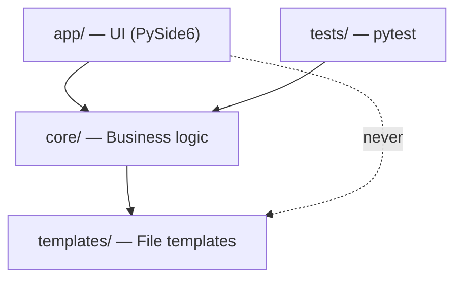

# Luthier Architecture

This document describes the three-layer architecture, module contracts, and rendering pipeline for contributors. The canonical architecture decisions live in [`architecture-spine.md`](../_bmad-output/planning-artifacts/architecture/architecture-Luthier-2026-06-22/architecture-spine.md).

> **Companion doc:** [`architecture-explained.md`](../_bmad-output/planning-artifacts/architecture/architecture-Luthier-2026-06-22/architecture-explained.md) is the narrative walkthrough; Decisions 5–7 mark superseded Epic 1 text and point here for AD-5 / AD-7. **This file and the Spine are the sources of truth.**

## Three-layer design

Luthier uses a **strict layered architecture** with a typed central model. Dependencies flow downward only.



### Golden rule (AD-8)

**`core/` never imports from `app/`.** Violations collapse the layer boundary and make core untestable without a display. Some `core/` modules use `QStandardPaths` for OS config paths only — no `QWidget` imports and no import from `app/`.

**`app/` never imports from `templates/` directly.** All template access goes through `core/ProjectGenerator` and `core/ProjectWriter`.

## ProjectSpec — cross-layer contract (AD-1, AD-2)

[`core/project_spec.py`](../core/project_spec.py) defines the `ProjectSpec` dataclass — the **sole cross-layer contract** for project data.

- No layer passes a raw `dict` of project data across a layer boundary.
- Fields use `snake_case` in Python; CMake template placeholders use `camelCase`.
- `ProjectSpec` carries identity fields, artefact config, **and `juce_dir`** (AD-7).
- `ProjectPage.spec()` → `ProjectGenerator.generate(spec)` → `ProjectWriter.write(..., spec)`.

## Data flow

```
User fills form (ProjectPage)
  → ProjectPage.spec() → ProjectSpec
  → MainWindow._on_generate()
      → ProjectGenerator.generate(spec)
          → render_context.build_context(spec)  → dict for str.format
          → render_context.build_tokens(spec)   → dict for @KEY@ replace
          → ProjectWriter.write(context, tokens, spec)
              → files on disk + .luthier.json sidecar
```

### Round-trip reload (AD-3)

[`core/project_reader.py`](../core/project_reader.py) `read_project(project_dir)` is the sole deserialiser:

1. **Sidecar first** — reads `.luthier.json` if present.
2. **CMake regex fallback** — `_parse_cmakelists()` when sidecar is absent.
3. **Partial parse → `None`** — the UI reports load failure; never silently loads a partial spec.

## Two-pass rendering

[`core/project_writer.py`](../core/project_writer.py) applies three write strategies:

| Strategy | Function | Placeholder style | Files |
|----------|----------|-------------------|-------|
| **Pass 1 — str.format** | `rendering.render()` | `{projectName}`, `{cxxStandard}`, … | `_RENDERED` |
| **Pass 2 — token replace** | `rendering.render_tokens()` | `@PROJECT_NAME@`, `@PROJECT_DISPLAY_NAME@` | `_TOKENIZED` |
| **Verbatim copy** | direct read/write | — | `_VERBATIM` |

### Pass 1 — `_RENDERED` (str.format)

[`core/rendering.py`](../core/rendering.py) `render(content, context)` calls `str.format(**context)`.

Files:

- `CMakeLists.txt`
- `CMakeUserPresets.json`
- `.vscode/settings.json`
- `.vscode/tasks.json`
- `.vscode/launch.json`
- `README.md`

**CMake literal braces:** CMake variables use doubled braces so they survive `str.format` — e.g. `${{CMAKE_SOURCE_DIR}}` in the template becomes `${CMAKE_SOURCE_DIR}` in output.

Context is built by [`render_context.build_context()`](../core/render_context.py) from `ProjectSpec`.

### Pass 2 — `_TOKENIZED` (@KEY@ replace)

[`rendering.render_tokens()`](../core/rendering.py) replaces `@KEY@` placeholders. Only two tokens exist:

| Token | Source field |
|-------|--------------|
| `@PROJECT_NAME@` | `spec.project_name` |
| `@PROJECT_DISPLAY_NAME@` | `spec.project_display_name` |

Files:

- `Source/PluginProcessor.h`
- `Source/PluginProcessor.cpp`
- `Source/PluginEditor.h`
- `Source/PluginEditor.cpp`

C++ templates must remain **valid C++ without substitution** — tokens are optional display names only.

### Verbatim — `_VERBATIM`

Copied unchanged from `templates/` (or user override):

- `.vscode/extensions.json`
- `.cursorrules`
- `.gitignore`
- `CMake/CopyVst3Elevated.ps1`

## Atomic write (AD-4)

`ProjectWriter.write()` writes to a sibling temp directory (`<name>.tmp/`), writes `.luthier.json`, then renames atomically. On failure, the temp directory is cleaned up and the original project is left untouched.

## Preferences and persistence (AD-5 revised)

- `preferences.json` is written **only** by: first-launch factory file, Preferences tab auto-save, or successful Import Preferences.
- **Open Project** and **Generate Project** never call `prefs.save()`.
- `core/` never calls `prefs.save()` directly.

## Atomic JSON persistence (AD-10)

`preferences.json` and `app_state.json` are written via [`core/json_files.py`](../core/json_files.py) `atomic_write_text()` — content goes to a sibling `{filename}.tmp`, then `Path.replace()` commits atomically (same semantics as AD-4 for a single file). On write failure after the temp file is created, the temp file is removed and the live file is never truncated.

On read failure (`JSONDecodeError`, `OSError`, or non-`dict` root), `Preferences.load()` and `AppState.load()` reset in-memory state to factory defaults, rewrite a clean file, and expose a `load_warning` string for the app layer. Valid JSON with invalid profile values still follows the existing `validate_profile` / `accent_color_warning` paths — no corrupt-file notification for that case.

`MainWindow` surfaces `load_warning` via the status bar at startup (after generator errors, before accent warnings).

## juce_dir (AD-7 revised)

- `ProjectSpec.juce_dir` is written to `.luthier.json` and participates in round-trip.
- `render_context.build_context(spec)` reads `spec.juce_dir` — no separate parameter.
- `Preferences.juce_dir` is the **default seed only** for new projects — copied at startup and Create New Project, not read at Generate time.

## Template overrides (AD-9)

`ProjectSpec` carries no reference to user template overrides. `ProjectWriter` resolves overrides at write time via `templates_store.overrides_dir()` — injected at construction.

## Module contracts

Each `core/*.py` module follows the schema: **Purpose | Inputs | Outputs | Invariants**.

| Module | Purpose | Inputs | Outputs | Invariants |
|--------|---------|--------|---------|------------|
| [`project_spec.py`](../core/project_spec.py) | Typed cross-layer data model | Field values / JSON dict | `ProjectSpec`, `to_dict()` | No raw dict across boundaries (AD-1); snake_case fields |
| [`project_generator.py`](../core/project_generator.py) | Orchestrates generation | `ProjectSpec`, optional template/override paths | `Path` to project dir | Uses `templates_dir()`; raises via writer on failure |
| [`project_writer.py`](../core/project_writer.py) | Renders + writes project tree | `context`, `tokens`, `ProjectSpec` | Files on disk + `.luthier.json` | Atomic temp-dir rename (AD-4); overrides at write time (AD-9) |
| [`project_reader.py`](../core/project_reader.py) | Reload project into spec | `project_dir: Path` | `ProjectReadResult` (`spec`, `missing_fields`); `read_project()` → `Optional[ProjectSpec]` | Sidecar first; partial CMake → `None` (AD-3) |
| [`render_context.py`](../core/render_context.py) | Spec → template data | `ProjectSpec` | `build_context()` dict, `build_tokens()` dict | Reads `spec.juce_dir` (AD-7); camelCase template keys |
| [`rendering.py`](../core/rendering.py) | Template substitution | template str + dict | rendered str | Two mechanisms: `format` vs `@KEY@` replace |
| [`validation.py`](../core/validation.py) | Field validators | `str` field value | `(bool, str)` tuple | Pure functions; no I/O |
| [`plugin_settings.py`](../core/plugin_settings.py) | JUCE flag/category helpers | type strings / flags | dicts, bundle_id, categories | Pure; no side effects |
| [`preferences.py`](../core/preferences.py) | Global profile JSON | dict / file I/O | `Preferences` object | Atomic save (AD-10); save only via app layer (AD-5); corrupt load → defaults + `load_warning` |
| [`app_state.py`](../core/app_state.py) | Last-used parent dir | path strings | `AppState` JSON | Atomic save (AD-10); corrupt load → defaults + `load_warning`; separate from Import/Export profile |
| [`json_files.py`](../core/json_files.py) | Atomic text writes | `Path`, content str | file on disk | Temp sibling + `replace()`; cleanup on failure |
| [`templates_store.py`](../core/templates_store.py) | User C++ template overrides | filename, content | read/write override files | Overrides under `QStandardPaths`; not in ProjectSpec |
| [`project_form_state.py`](../core/project_form_state.py) | Dirty guard for Create New Project | form snapshots | bool equality | Used by `app/` and unit tests |

## Testing {#testing}

Strategy (AD-6):

| Tier | Location | Scope |
|------|----------|-------|
| Unit | `tests/unit/` | Public `core/` APIs; a few tests import `app/` field-spec helpers; no GUI |
| Integration | `tests/integration/` | Full `ProjectSpec → write → read` round-trip with `tmp_path` |

- **158 tests** collected; no display required for the default suite.
- `tests/integration/test_frozen_bundle.py` — validates PyInstaller output when `dist/` exists on the current host; skipped when no bundle is present.
- `tests/integration/test_cmake_cross_platform.py` — CMake configure validation on generated projects; Windows and Linux configure tests run only on matching hosts (validated 2026-06-26).
- Legacy `tests/test_story_*.py` unittest modules remain collected.
- Dev dependency: `pytest>=8.0` in `requirements-dev.txt`.

Run: `.venv/bin/pytest`

## Product reference

Authoritative product documents (do not duplicate into `docs/`):

| Document | Path |
|----------|------|
| PRD | [`_bmad-output/planning-artifacts/prds/prd-Luthier-2026-06-22/prd.md`](../_bmad-output/planning-artifacts/prds/prd-Luthier-2026-06-22/prd.md) |
| Architecture Spine | [`_bmad-output/planning-artifacts/architecture/architecture-Luthier-2026-06-22/architecture-spine.md`](../_bmad-output/planning-artifacts/architecture/architecture-Luthier-2026-06-22/architecture-spine.md) |
| Epics | [`_bmad-output/planning-artifacts/epics.md`](../_bmad-output/planning-artifacts/epics.md) |
| Project context | [`_bmad-output/project-context.md`](../_bmad-output/project-context.md) |

See also [CONTRIBUTING.md](../CONTRIBUTING.md) for setup and onboarding.
