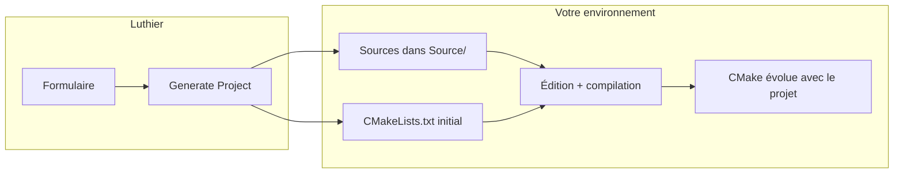

# Luthier — Manuel utilisateur

Ce manuel est le document de référence pour **Luthier** : il explique d’abord *pourquoi* l’outil existe et comment s’inscrire dans l’écosystème JUCE/CMake, puis *comment* l’utiliser pas à pas — de la première génération à la compilation dans votre IDE.

Luthier crée des **projets JUCE de démarrage** (plugins AU/VST3 et applications Standalone) prêts à compiler sous Windows, macOS et Linux. Vous remplissez un formulaire, cliquez sur **Generate Project**, puis poursuivez le développement dans l’environnement de votre choix. Luthier ne rouvre ni ne recharge les projets existants : une génération, puis la main à vous (ou à votre IDE agentique).

Chaque section explique d’abord *à quoi sert* un concept ou un réglage, puis *comment* l’utiliser. Pour aller vite : [Votre premier projet en quelques minutes](#7-votre-premier-projet-en-quelques-minutes).

> **Langue de l’interface** — Luthier s’affiche en **anglais**. Les libellés cités ci-dessous reprennent exactement le texte à l’écran. Édition anglaise : [user-manual.md](user-manual.md).

---

## Table des matières

**Partie I — Contexte**

1. [Luthier en bref](#1-luthier-en-bref)
2. [Créer un plugin ou une app audio/MIDI](#2-créer-un-plugin-ou-une-app-audiomidi)
3. [JUCE et l’écosystème](#3-juce-et-lécosystème)
4. [Projucer et CMake : deux approches](#4-projucer-et-cmake--deux-approches)
5. [CMake à la main](#5-cmake-à-la-main)
6. [Périmètre de Luthier et passation vers l’IDE](#6-périmètre-de-luthier-et-passation-vers-lide)

**Partie II — Démarrer**

7. [Votre premier projet en quelques minutes](#7-votre-premier-projet-en-quelques-minutes)
8. [Installation et lancement de Luthier](#8-installation-et-lancement-de-luthier)

**Partie III — Utiliser Luthier**

9. [Fenêtre principale](#9-fenêtre-principale)
10. [Trois types de réglages pour vos projets JUCE](#10-trois-types-de-réglages-pour-vos-projets-juce)
11. [Premier lancement de Luthier](#11-premier-lancement-de-luthier)
12. [Onglet Project](#12-onglet-project)
13. [Onglet Preferences](#13-onglet-preferences)
14. [Onglet Templates](#14-onglet-templates)
15. [Onglet About](#15-onglet-about)
16. [Parcours types](#16-parcours-types)
17. [Ce que Luthier génère](#17-ce-que-luthier-génère)
18. [Où sont stockées vos données](#18-où-sont-stockées-vos-données)
19. [Règles de validation des champs](#19-règles-de-validation-des-champs)
20. [Normalisation des chemins](#20-normalisation-des-chemins)
21. [Messages, erreurs et dépannage](#21-messages-erreurs-et-dépannage)
22. [Utiliser l’application Luthier autonome](#22-utiliser-lapplication-luthier-autonome)
23. [Pour aller plus loin](#23-pour-aller-plus-loin)

---

## 1. Luthier en bref

**Luthier** est une application de bureau (Windows, macOS, Linux) qui génère en une fois un **projet JUCE de démarrage** complet : fichiers CMake, sources C++ de base, métadonnées du plugin, presets multi-plateforme. Le résultat s’ouvre dans Cursor, VS Code, Xcode, Visual Studio ou tout autre environnement compatible CMake — et compile immédiatement, sans retoucher la configuration initiale.

### Intérêt concret

| Ce que Luthier vous apporte | Détail |
|-----------------------------|--------|
| **Démarrage rapide** | Formulaire inspiré de Projucer → dossier prêt à compiler en quelques minutes |
| **Multi-plateforme** | Presets CMake pour Windows, macOS (ARM, Intel, Universal…) et Linux |
| **Formats courants** | AU, VST3, Standalone — selon vos cases cochées |
| **CMake natif** | Compatible IDE modernes, CI/CD et outils agentiques (Cursor, Antigravity, Claude Code…) |
| **Personnalisation** | Defaults persistants, templates C++ modifiables, profils exportables |

### Ce que Luthier fait

- Génère des projets AU, VST3 et/ou Standalone à partir d’un formulaire (onglet **Project**).
- Écrit `CMakeLists.txt`, `CMakeUserPresets.json`, les sources, des aides IDE optionnelles et `.luthier.json` (instantané écrit à la génération — référence uniquement ; Luthier ne le relit jamais).
- Enregistre vos **valeurs par défaut** dans `preferences.json` sur votre machine.
- Permet de personnaliser les **modèles sources C++** (`PluginProcessor`, `PluginEditor`).
- Bloque la génération dans un dossier **non vide** ; autorise la **régénération en session** (même session, même chemin) avec confirmation destructive qui préserve `.git`.

### Ce que Luthier ne fait pas

- **Rouvrir** ou recharger un projet dans le formulaire — après génération, travaillez dans votre IDE.
- **Compiler** votre projet — CMake et votre toolchain s’en chargent.
- **Télécharger ou installer** JUCE — vous indiquez un dossier SDK existant.
- **Synchroniser** les réglages entre machines — utilisez **Export Preferences…** / **Import Preferences…**.

Ces limites sont volontaires : Luthier reste un générateur de départ **léger et prévisible**. Les sections [§5](#5-cmake-à-la-main) et [§6](#6-périmètre-de-luthier-et-passation-vers-lide) expliquent pourquoi.

> **Phrase à retenir** — Luthier vous évite la montée du jour 0. CMake et votre IDE vous accompagnent tous les jours suivants.

Dépôt : [github.com/tensquaresoftware/luthier](https://github.com/tensquaresoftware/luthier)

---

## 2. Créer un plugin ou une app audio/MIDI

Avant d’ouvrir Luthier, voici ce qu’implique la création d’un **plugin audio** (VST3, AU…) ou d’une **application autonome** audio/MIDI pour Windows, macOS et Linux.

### Types de produits visés

| Type | Description | Formats typiques |
|------|-------------|------------------|
| **Plugin audio** | Traitement ou génération de signal dans une DAW | **VST3**, **AU** (macOS), **Standalone** |
| **Application standalone** | App audio/MIDI avec interface graphique | Exécutable natif (`.app`, `.exe`…) |
| **Instrument / effet / effet MIDI** | Sous-types selon le rôle | Catégories VST3/AU adaptées par JUCE |

### Ce dont vous aurez besoin

| Élément | Rôle |
|---------|------|
| **SDK JUCE** | Framework C++ — bibliothèques et outils de build |
| **CMake 3.22+** | Décrit *comment* compiler le projet |
| **Toolchain C++** | Compilateur adapté à votre OS (Visual Studio, Xcode, GCC/Clang…) |
| **IDE ou éditeur** | Cursor, VS Code, Xcode, Visual Studio… pour coder et lancer la compilation |
| **Dossier de destination** | Où Luthier créera le dossier de votre projet |

Le `README.md` de chaque projet généré liste les prérequis exacts et les commandes de build pour votre plateforme.

### CMake et IDE : deux rôles distincts

- **CMake** *configure* la compilation (fichiers à compiler, chemin JUCE, formats produits). Luthier génère ces fichiers pour vous.
- Votre **IDE** *lance* cette compilation. Cursor et VS Code avec l’extension **CMake Tools** constituent le chemin le plus direct : chaque projet Luthier inclut des presets et tâches dans `.vscode/`.

### Formats de plugin (rappel)

- **VST3** — Windows, macOS, Linux
- **AU** (*Audio Unit*) — macOS uniquement à la compilation
- **Standalone** — application autonome du plugin ; idéal pour un premier test sans DAW

---

## 3. JUCE et l’écosystème

### JUCE en bref

**JUCE** (*Jules' Utility Class Extensions*) est un framework C++ open source, référence pour les plugins audio et applications audio multiplateformes. Vous écrivez votre logique métier ; JUCE fournit l’API audio, les wrappers VST3/AU/Standalone, l’interface graphique, le MIDI et bien plus.

- Site : [juce.com](https://juce.com)
- Dépôt : [github.com/juce-framework/JUCE](https://github.com/juce-framework/JUCE)
- Licence : gratuite pour l’open source (AGPL) ou commerciale selon usage — [juce.com/legal](https://juce.com/legal)

Luthier génère des projets qui *utilisent* JUCE mais ne l’inclut pas : installez le SDK séparément, puis indiquez son chemin dans **JUCE directory** (voir [§12.6](#126-workspace)).

### Alternatives à connaître

JUCE n’est pas le seul choix pour créer des plugins audio, mais c’est le plus complet pour un projet desktop multi-format :

| Framework | Points forts | Limite par rapport à Luthier |
|-----------|--------------|--------------------------------|
| **[iPlug2](https://github.com/iPlug2/iPlug2)** | Léger, bon pour VST3/AU/CLAP, courbe d’apprentissage modérée | Écosystème et GUI moins vastes que JUCE ; Luthier ne le cible pas |
| **[DPF](https://github.com/DISTRHO/DPF)** (*DISTRHO Plugin Framework*) | Minimaliste, open source, LV2/VST2/VST3/CLAP | Moins de fonctionnalités « tout-en-un » ; pas de GUI riche intégrée comme JUCE |

Luthier est conçu **exclusivement pour JUCE + CMake**. Si vous choisissez iPlug2 ou DPF, d’autres générateurs ou templates s’appliquent.

> **Note — CLAP et JUCE 9**  
> Le format **CLAP** progresse dans l’écosystème open source. JUCE 9 annonce du travail en cours. À la date de ce manuel (2026), VST3 et AU restent les références pour la production ; surveillez les [releases JUCE](https://github.com/juce-framework/JUCE/releases).

---

## 4. Projucer et CMake : deux approches

JUCE propose des **outils** pour structurer vos projets. Deux philosophies coexistent :

```
┌──────────────────────────────────────────────────────────────────┐
│                        PROJUCER                                  │
│  Source de vérité = fichier .jucer (XML)                         │
│  Sortie = projets IDE natifs (Builds/Xcode, Builds/VS…)          │
│  Régénération = réécrit la vue IDE à chaque Save                 │
└──────────────────────────────────────────────────────────────────┘

┌──────────────────────────────────────────────────────────────────┐
│                         CMAKE                                    │
│  Source de vérité = CMakeLists.txt                               │
│  Sortie = cache de build + binaires (Builds/…)                   │
│  Reconfigure = relit CMakeLists.txt, ne touche pas à vos sources │
└──────────────────────────────────────────────────────────────────┘
```

Les deux peuvent produire le **même plugin fonctionnel**. Ce qui change : **qui tient la configuration** et **comment l’IDE se resynchronise**.

### Projucer : atouts et limites

**Projucer** est l’application fournie avec JUCE : formulaire de configuration + explorateur de fichiers, pas un IDE.

Lors d’un **Save** ou **Save and Open in IDE**, Projucer enregistre le `.jucer`, **régénère** les projets Xcode/Visual Studio/Makefile dans `Builds/`, puis ouvre l’IDE. Il ne produit **pas** de `CMakeLists.txt`.

**Règle essentielle avec Projucer** — créez et organisez vos fichiers sources **depuis Projucer**, pas directement dans Xcode ou Visual Studio. À chaque Save, Projucer réécrit le projet IDE depuis le `.jucer`. Un fichier ajouté uniquement dans l’IDE disparaît du build au prochain Save.

| Limite | Conséquence |
|--------|-------------|
| **Pas d’export CMake natif** | Exporters Xcode, VS, Makefile — pas CMake |
| **Régénération IDE** | Chaque Save peut écraser les changements faits seulement dans l’IDE |
| **Source de vérité unique (.jucer)** | Difficile de mélanger avec un workflow « IDE d’abord » |
| **IDE modernes non ciblés** | Cursor, Antigravity, Claude Code… consomment CMake + `compile_commands.json`, pas `.xcodeproj` |

Projucer reste pertinent pour un workflow « Xcode + Projucer » classique. Il devient contraignant dès que l’on veut CMake, multi-IDE, CI/CD ou développement assisté par IA.

### Ce que recommande l’équipe JUCE

> **Pour les nouveaux projets, privilégier CMake.**

- Documentation : [CMake API JUCE](https://github.com/juce-framework/JUCE/blob/master/docs/CMake%20API.md)
- Exemples : [examples/CMake](https://github.com/juce-framework/JUCE/tree/master/examples/CMake)
- Fonctions : `juce_add_plugin`, `juce_add_gui_app`, etc.
- Projucer reste maintenu, mais n’est plus le chemin privilégié pour démarrer

| Avantage CMake | Détail |
|----------------|--------|
| **IDE-agnostique** | Même projet dans Cursor, VS Code, CLion ou Terminal |
| **Standard industrie** | Compétence réutilisable hors JUCE |
| **Pas de régénération opaque** | Vous éditez la description du build ; CMake reconfigure |
| **CI/CD** | GitHub Actions, builds croisés |
| **Coding agentique** | L’IA lit et modifie `CMakeLists.txt` comme n’importe quel texte |

---

## 5. CMake à la main

Vous pouvez créer un projet JUCE/CMake **sans Luthier** — en copiant les [exemples officiels](https://github.com/juce-framework/JUCE/tree/master/examples/CMake) ou en suivant la [CMake API](https://github.com/juce-framework/JUCE/blob/master/docs/CMake%20API.md). Voici ce que cela implique.

### Les deux fichiers centraux

**`CMakeLists.txt`** — le plan de construction : nom du projet, chemin JUCE, sources à compiler, type de plugin, formats, modules JUCE, options C++. **Ce fichier évolue avec votre projet** ; ce n’est pas un fichier « posé une fois pour toutes ».

**`CMakeUserPresets.json`** — raccourcis pour configurer et compiler sans retaper les options (Debug/Release, OS, architecture). Luthier en génère un jeu complet ; en manuel, vous le composez vous-même.

### Maintenance courante du CMake

| Situation | Action typique |
|-----------|----------------|
| Nouvelle classe / `.cpp` | Ajouter le fichier à la liste des sources |
| Nouvelle ressource (image, police) | Mettre à jour `juce_add_binary_data` ou équivalent |
| Nouveau module JUCE | Ajouter `juce::juce_xxx` dans `target_link_libraries` |
| Option de build custom | Ajouter `option()` ou `set()` commentés |

Puis **reconfigurer** CMake (souvent automatique avec CMake Tools).

Contrairement à Projucer, vos **fichiers sources ne sont jamais écrasés** par une reconfiguration — seul le cache de build est mis à jour.

### Si vous êtes à l’aise avec le Terminal et les lignes de commande

CMake se pilote entièrement en CLI :

```bash
cmake --preset macos-debug-arm64      # configure
cmake --build --preset macos-debug-arm64   # compile
```

Un éditeur minimal + Terminal suffit si vous acceptez moins d’autocomplétion C++ (sans `compile_commands.json`) et un débogage en ligne de commande (`lldb`/`gdb`). La plupart des développeurs préfèrent un IDE ou un éditeur enrichi qui *consomme* les fichiers CMake.

**Qui maintient le CMake au fil du temps ?**

| Contexte | Approche |
|----------|----------|
| **IDE agentique** (Cursor, Antigravity, Claude Code…) | L’IA met à jour `CMakeLists.txt` sur demande (« ajoute cette classe au build ») |
| **IDE classique** (VS Code + CMake Tools, CLion, Xcode…) | Vous éditez `CMakeLists.txt` directement |

Les deux approches sont valides ; la différence porte sur *qui* tape les modifications.

---

## 6. Périmètre de Luthier et passation vers l’IDE

### Pourquoi Luthier existe

Démarrer un projet JUCE/CMake **correctement configuré** demande de nombreuses décisions dès la première minute : codes plugin compatibles GarageBand, presets multi-OS, formats, copie vers dossiers système, standard C++… Luthier condense tout cela dans un **formulaire** inspiré de Projucer et produit directement un projet CMake natif.

### Ce que Luthier fait — et ne fait pas

| ✅ Luthier | ❌ Luthier ne |
|-----------|--------------|
| Génère le **projet de départ** une fois | Rouvre et reconfigure un projet existant |
| Pose CMake + presets + sources de base | Gère l’arborescence sources au fil du développement |
| Écrit `.luthier.json` comme archive des métadonnées initiales | Fusionne proprement un `CMakeLists.txt` devenu complexe |
| Accélère le **jour 0** | Remplace Projucer pour tous les scénarios |

Construire un « Projucer CMake » capable de rouvrir, modifier les caractéristiques et resynchroniser l’IDE **sans rien casser** exigerait des mécanismes de fusion et de zones protégées dans CMake — un investissement considérable, comparable à des outils communautaires comme [FRUT](https://github.com/McMartin/FRUT), avec une couche GUI en plus. Pour un workflow centré IDE ou IA, le rapport effort/bénéfice n’y est pas.

Rappel Projucer : toute modification de configuration ou de liste de sources repasse par l’application. Avec Luthier + CMake, **la liste des sources et la config évoluent dans l’IDE** (ou via l’IA), pas dans un formulaire externe.

### Où s’arrête Luthier, où commence le développement



1. **Generate Project** écrit la structure initiale sur le disque.
2. Vos **sources** vivent dans `Source/` (et ailleurs) — créées **depuis votre IDE**, librement.
3. Votre **`CMakeLists.txt` évolue** — par vous, ou par l’IA dans un IDE agentique.
4. **Ne relancez pas Generate** sur un projet déjà développé (sauf régénération en session volontaire — voir [§16.3](#163-régénération-en-session-même-session-applicative)) : cela écraserait le travail accumulé.
5. **Reconfigurez CMake** quand la description du build change.

### Travailler avec un IDE agentique ou une IA

Dans Cursor, Antigravity ou Claude Code, une instruction du type :

> *« Crée la classe `FooBar` dans `Source/Core/` et ajoute-la au build »*

provoque typiquement : création des `.h`/`.cpp`, mise à jour de la liste des sources dans `CMakeLists.txt`, reconfiguration du projet. C’est **plus fluide** que de retourner dans un générateur — surtout quand le projet compte des centaines de fichiers, des blocs BinaryData, des tests ou des hooks post-build.

Le fichier `.luthier.json` reste une **photographie** des choix initiaux (nom, codes, chemins…). Utile comme référence pour vous ou pour l’IA ; Luthier ne le relit pas.

La gestion manuelle de `CMakeLists.txt` reste bien entendu possible — c’est le workflow standard de la communauté JUCE/CMake.

### Quel chemin choisir ?

| Critère | Projucer + IDE natif | CMake manuel | **Luthier → CMake** |
|---------|---------------------|--------------|---------------------|
| Démarrage | Rapide | Long | **Rapide** |
| Cursor / IDE agentique | Non (nativement) | Oui | **Oui** |
| Multi-IDE / CI | Limité | Oui | **Oui** |
| Sources au fil du temps | Depuis Projucer | Depuis l’IDE | **Depuis l’IDE** |
| Reconfigurer après coup | Via Projucer | Édition CMake | **Édition CMake / IA** |

---

## 7. Votre premier projet en quelques minutes

De zéro à une application Standalone qui compile — étapes dans l’ordre.


**Étape 0 — Installer JUCE (une fois par machine)**

1. Téléchargez JUCE sur [juce.com](https://juce.com) ou clonez [github.com/juce-framework/JUCE](https://github.com/juce-framework/JUCE).
2. Placez le dossier à un emplacement stable :
   - macOS : `/Applications/JUCE`
   - Windows : `C:/Program Files/JUCE`
   - Linux : `/usr/local/JUCE`

**Étape 1 — Lancer Luthier et régler Preferences**

1. Ouvrez Luthier → onglet **Preferences**.
2. Renseignez **Manufacturer** (ex. `My Studio`).
3. Dans **Workspace**, pour **votre OS actuel** :
   - **Destination folder** → **Choose…** → dossier parent (ex. `~/Documents/Plugins`).
   - **JUCE directory** → **Choose…** → dossier JUCE de l’étape 0.
4. Laissez AU, VST3 et Standalone cochés — **Standalone** est le plus simple pour un premier test.

**Étape 2 — Générer le projet**

1. Onglet **Project** → **Project name** : `MyFirstPlugin`.
2. Cliquez **Generate** à côté de **Plugin code**.
3. Cliquez **Generate Project** — la barre de statut confirme le chemin.

**Étape 3 — Compiler (Cursor ou VS Code)**

1. Installez [Cursor](https://cursor.com) ou [VS Code](https://code.visualstudio.com) + extension **CMake Tools**.
2. **File → Open Folder** → dossier `MyFirstPlugin` généré.
3. Attendez la configuration CMake ; choisissez un preset :
   - macOS Apple Silicon : `macos-debug-arm64`
   - Windows : `windows-debug`
   - Linux : `linux-debug`
4. Compilez : **Ctrl+Shift+B** / **Cmd+Shift+B**, ou palette → **CMake: Build**.

**Étape 4 — Tester**

Le format **Standalone** produit une `.app`, `.exe` ou binaire lançable directement — sans DAW. Chemin habituel : `Builds/…/Standalone/` (détails dans le `README.md` du projet).

**Autres IDE** — Xcode et Visual Studio fonctionnent ; le `README.md` généré documente aussi les commandes Terminal. Les dossiers `.vscode/` et `.cursorrules` sont optionnels.

**En cas de blocage** — vérifiez **JUCE directory**, CMake 3.22+, puis [§21](#21-messages-erreurs-et-dépannage).

---

## 8. Installation et lancement de Luthier

Choisissez la voie qui correspond à votre usage. Si vous recevez un installeur ou une archive, privilégiez l’application autonome. Si vous travaillez dans le dépôt Luthier, suivez la procédure développeur.

Luthier fonctionne sur **Windows**, **macOS** et **Linux** — depuis les sources (Python + PySide6) ou comme **application autonome** (PyInstaller). L’interface est identique ; seule l’installation diffère.

Sur **macOS**, l’application autonome `Luthier.app` requiert un Mac **Apple Silicon** (arm64). Les Mac Intel ne sont pas pris en charge pour l’application. Les projets JUCE générés restent compilables pour Mac Intel (presets CMake `macos-debug-x86_64`, `macos-release-x86_64`).

### Depuis les sources (développeurs)

Cette voie suppose Python 3.11+ et un environnement virtuel. Consultez [CONTRIBUTING.md](../../CONTRIBUTING.md) dans le dépôt pour la procédure complète. En résumé :

```bash
python3 -m venv .venv
source .venv/bin/activate          # Windows : .venv\Scripts\activate
pip install -r requirements-dev.txt
.venv/bin/python main.py           # Windows : .venv\Scripts\python main.py
```

### Application autonome (utilisateurs finaux)

Téléchargez ou construisez le bundle pour votre système, puis lancez l’application comme toute application native : aucune installation Python n’est requise sur la machine. Les modèles de projet et les bibliothèques graphiques sont embarqués dans le dossier distribué — voir [§22](#22-utiliser-lapplication-luthier-autonome) pour les précisions par plateforme.

---

## 9. Fenêtre principale

L’interface de Luthier est volontairement simple : un onglet par grande tâche, un formulaire central, des boutons d’action en bas. Prenez un instant pour repérer les quatre zones ci-dessous. Elles reviendront dans tout le reste du manuel.

À l’ouverture de Luthier, vous voyez :

```
┌───────────────────────────────────────────────────┐
│  Project │ Preferences │ Templates │ About        │  ← Barre d’onglets
├───────────────────────────────────────────────────┤
│                                                   │
│            Contenu de l’onglet actif              │  ← Formulaire ou éditeur défilable
│                                                   │
├───────────────────────────────────────────────────┤
│     Message de statut (centré, pleine largeur)    │  ← Barre de statut dédiée
├───────────────────────────────────────────────────┤
│          [Boutons d’action de l’onglet]           │  ← Barre d’actions
└───────────────────────────────────────────────────┘
```

### Barre d’onglets

| Onglet | Rôle |
|--------|------|
| **Project** | Configurer le projet JUCE sur lequel vous travaillez. |
| **Preferences** | Modifier les valeurs par défaut globales qui pré-remplissent les nouveaux projets. |
| **Templates** | Voir et personnaliser les modèles C++ / `.gitignore` utilisés à la génération. |
| **About** | Crédits, version et liens. |

### Barre de statut

La barre de statut est votre retour principal après une action importante (génération, import). Après la plupart des opérations, un court message s’affiche dans une **barre dédiée au-dessus des boutons d’action**, centrée sur toute la largeur de la fenêtre :

- les messages de **succès** utilisent la **couleur d’accent** (personnalisable — magenta par défaut)
- les messages d’**erreur** sont en rouge
- les chemins longs passent sur plusieurs lignes au lieu d’encombrer les boutons

Exemples : *« Project generated at /Users/vous/Documents/MySynth »*, *« Project regenerated at … »*, *« Preferences imported from client-a.json »*.

L’enregistrement automatique dans **Preferences** affiche uniquement un badge **Saved** sur le champ modifié — il n’utilise pas cette barre de statut globale.

### Barre d’actions

Les boutons en bas **changent selon l’onglet actif** :

| Onglet | Boutons |
|--------|---------|
| **Project** | **Create New Project**, **Generate Project** |
| **Preferences** | **Import Preferences…**, **Export Preferences…** |
| **Templates** | **Load from file…**, **Reset to default**, **Save override** |
| **About** | *(aucun)* |

### Taille et position de la fenêtre

Luthier mémorise la taille et l’état maximisé de la fenêtre entre les sessions. Sous **macOS** et **Windows**, la position est également restaurée. Sous **Linux**, la taille est en général retrouvée ; la **position n’est pas garantie** (notamment sous Wayland, où le gestionnaire de fenêtres peut ignorer le placement demandé par l’application). Si la géométrie enregistrée n’est plus valide (par exemple après déconnexion d’un écran), la fenêtre s’ouvre centrée avec une taille par défaut confortable.

---

## 10. Trois types de réglages pour vos projets JUCE

La première source de confusion, pour un nouvel utilisateur, est de mélanger ce qui concerne **le projet JUCE en cours**, ce qui sert de **valeurs par défaut** et ce qui définit le **code source de départ**. Luthier sépare clairement ces trois domaines dans trois onglets. Le tableau ci-dessous résume la logique.

Comprendre cette distinction évite la plupart des questions du type « j’ai changé Preferences, pourquoi mon onglet Project n’a pas bougé ? »

| Domaine | Onglet | Portée | Répond à la question |
|---------|--------|--------|----------------------|
| **Projet en cours** | Project | Un projet JUCE à la fois | *Comment **ce** projet JUCE est-il configuré ?* |
| **Valeurs par défaut globales** | Preferences | Toute l’app, tous les futurs projets | *Quelles valeurs réutiliser à chaque fois ?* |
| **Modèles globaux** | Templates | Toute l’app, tous les projets générés | *Quel code source de départ pour les nouveaux projets JUCE ?* |

**Règles importantes :**

- Modifier **Preferences** ne change **pas** l’onglet **Project** tant que vous n’avez pas cliqué sur **Create New Project** (ou relancé l’app pour le peuplement initial).
- **Generate Project** n’écrit **jamais** dans `preferences.json`.
- Les personnalisations de l’onglet **Templates** sont appliquées à chaque **Generate Project**. En revanche, **Export Preferences…** n’exporte que le profil de **Preferences**. Vos overrides de templates restent dans le dossier `templates/` de la configuration Luthier (voir [§18](#18-où-sont-stockées-vos-données)). Copiez-les séparément si vous changez de machine.

En résumé : **Preferences** et **Templates** préparent l’avenir. **Project** décrit le projet JUCE sur lequel vous travaillez *maintenant*. La génération lit uniquement **Project** (et les templates), jamais l’inverse.

---

## 11. Premier lancement de Luthier

Au tout premier démarrage, Luthier initialise un profil local avec des valeurs usine raisonnables. Vous pouvez générer un projet tout de suite, mais quelques minutes passées dans **Preferences** (fabricant, chemins, JUCE) vous feront gagner du temps sur chaque projet JUCE suivant.

### Ce qui se passe automatiquement

1. Luthier crée **`preferences.json`** dans le dossier de configuration applicative de votre OS (première exécution uniquement).
2. Les valeurs usine sont écrites — voir le tableau ci-dessous.
3. L’onglet **Project** s’ouvre comme **nouveau projet** : champs d’identité vides, tout le reste copié depuis les préférences.

### Valeurs usine (premier `preferences.json`)

| Réglage | Valeur initiale |
|---------|-----------------|
| Manufacturer | `My Company` |
| Manufacturer code | `Myco` |
| Plugin code | `Mypl` |
| Copyright, Website, E-mail | vides |
| Workspace — Destination folder (Windows / macOS / Linux) | OS hôte → votre **Bureau** ; autres plateformes → vide |
| Workspace — JUCE directory (Windows / macOS / Linux) | vides (placeholder selon l’OS sur la ligne hôte, ex. `/Applications/JUCE` sur macOS) |
| Plugin type | Instrument (Synth) |
| Formats | AU, VST3, Standalone — tous cochés |
| C++ standard | C++17 |
| Preprocessor defs, Header search paths | vides |
| Copy to system plugin folders | désactivé |
| Copy to central artefacts folder | désactivé |
| Chemins d’artefacts (Windows / macOS / Linux) | vides |
| **Couleur d’accent** (`accentColor`) | Magenta (`#A45C94`) — défaut inspiré de Projucer |

### Premiers pas recommandés

1. Ouvrez **Preferences** et renseignez **Manufacturer**, les codes, et les chemins **Workspace**.
2. Passez à **Project**, saisissez un **Project name**, puis cliquez sur **Generate Project**.
3. Ouvrez le dossier généré dans votre IDE et suivez le `README.md` du projet.

Pour un guide pas à pas complet, voir [§7 — Votre premier projet en quelques minutes](#7-votre-premier-projet-en-quelques-minutes).

---

## 12. Onglet Project

C’est ici que vous décrivez **un** projet JUCE : son nom, son identité, ses formats, ses options de compilation et la destination des binaires après build. Pensez à cet onglet comme à la « fiche d’identité » du projet que Luthier va matérialiser sur le disque.

L’onglet est une page défilable divisée en sections. Les champs marqués d’un astérisque (*) sont obligatoires. Luthier vous signale les erreurs au fil de la saisie et désactive **Generate Project** tant que le formulaire n’est pas valide.

### 12.1 Project Info

Cette section regroupe l’**identité** du plugin : noms, version, fabricant et codes. Les codes fabricant et plugin peuvent paraître cryptiques au début : ils servent surtout aux hôtes macOS (Audio Unit) et doivent respecter des règles strictes — d’où le bouton **Generate** et le tableau ci-dessous.

| Champ | Obligatoire | Description |
|-------|-------------|-------------|
| **Project name** * | Oui | Nom technique — nom du dossier et cible CMake. Doit commencer par une lettre. Lettres, chiffres, `-`, `_` uniquement. |
| **Display name** | Non | Nom affiché dans les hôtes (DAW, application Standalone). Lettres, chiffres, espaces, `-` et `_` autorisés (ex. `My Synth 1`). Si vide, le **Project name** est utilisé. |
| **Version** * | Oui | Chaîne de version (défaut `1.0.0` pour un nouveau projet). |
| **Manufacturer** * | Oui | Nom de votre société ou nom personnel. |
| **Copyright** | Non | Ligne de copyright dans les métadonnées générées. |
| **Website** | Non | URL optionnelle. |
| **E-mail** | Non | Contact optionnel. |
| **Manufacturer code** * | Oui | Code AU compatible GarageBand : première lettre **majuscule**, puis trois lettres **minuscules** (ex. `Myco`). Le bouton **Generate** remplit un code valide aléatoire. |
| **Plugin code** * | Oui | Code AU compatible GarageBand : première lettre **majuscule**, puis trois lettres minuscules ou chiffres (ex. `Mypl`, `Dem0`). `DEMO` est réservé par Apple. Même bouton **Generate** que pour le manufacturer code. |
| **Bundle ID** | — | Champ en lecture seule. Calculé à partir du manufacturer et du project name. |

L’emplacement de création du projet et le chemin JUCE se configurent dans [§12.6 Workspace](#126-workspace), pas ici.

### 12.2 Plugin Type

Le type de plugin détermine comment JUCE câble les entrées/sorties audio et MIDI dans le processeur généré. Vous ne pouvez en choisir qu’**un** à la fois. Changez-le avant la première génération si besoin, ou régénérez après modification.

Choix exclusif :

| Type | Signification |
|------|---------------|
| **Instrument** (Synth) | Reçoit du MIDI, produit de l’audio. |
| **Audio Effect** | Traite l’audio entrant. |
| **MIDI Effect** | Traite le MIDI uniquement — pas d’E/S audio. |

### 12.3 Plugin Characteristics

Sous **Plugin Type**, la section **Plugin Characteristics** contrôle la façon dont JUCE câble les bus audio/MIDI dans le `CMakeLists.txt` et le `PluginProcessor.cpp` générés. Les options sont **contraintes par préréglage** selon le type de plugin — les cases indisponibles restent désactivées.

| Contrôle | Description |
|----------|-------------|
| **Plugin is a Synth** | Drapeau synth (préréglage Instrument). |
| **Plugin MIDI Input** | Active l’entrée MIDI. |
| **Plugin MIDI Output** | Active la sortie MIDI (ex. Instrument + MIDI Output pour un instrument qui envoie du MIDI vers la DAW). |
| **MIDI Effect Plugin** | Drapeau effet MIDI (préréglage MIDI Effect). |
| **Editor Requires Keyboard Focus** | Focus clavier pour l’éditeur du plugin. |
| **Audio I/O** | Liste déroulante préréglée : **Stereo**, **Mono**, **Synth No Input**, **MIDI Effect** (pas de bus audio). |
| **VST MIDI Inputs** / **VST MIDI Outputs** | Listes déroulantes **1–16** lorsque la case MIDI correspondante est activée. |
| **Plugin Description** | Correspond à `DESCRIPTION` dans le CMake du projet généré. |

**Indices par préréglage :**

- **Instrument** — MIDI Output peut être activé pour les instruments qui transmettent du MIDI.
- **Audio Effect** — MIDI Input ou Output optionnels pour des effets pilotés par MIDI.
- **MIDI Effect** — caractéristiques figées par le préréglage ; **Synth** et **MIDI Effect Plugin** ensemble sont invalides.

La disposition des bus générée reflète ces choix — pas le seul type de plugin.

### 12.4 Formats

Les formats définissent **sous quelle forme** votre projet JUCE sera compilé : module pour un DAW (AU, VST3) ou application autonome (Standalone). Cochez au moins celui que vous comptez tester en premier. Vous pourrez en ajouter d’autres plus tard via **Regenerate Project** dans la **même session Luthier** (même chemin), ou en éditant `CMakeLists.txt` manuellement après génération.

Sélectionnez **au moins un** format :

- **AU** (*Audio Unit*, compatible macOS uniquement)
- **VST3** (*Virtual Studio Technology*, compatible Windows/macOS/Linux)
- **Standalone**

Si aucun n’est coché, **Generate Project** reste désactivé et une indication apparaît sous les cases à cocher.

**Note :** le format AU n’est compilé que sur macOS. Sous Windows et Linux, CMake ignore ce format au moment du build. Laisser la case cochée permet d’ouvrir le même projet sur un Mac plus tard sans régénérer.

### 12.5 Compilation

Ces réglages sont transmis tels quels au `CMakeLists.txt` généré. Pour un premier projet, les valeurs par défaut (C++17, champs vides) conviennent en général. Revenez-y lorsque vous aurez besoin de drapeaux de préprocesseur ou de chemins d’en-têtes supplémentaires.

| Champ | Description |
|-------|-------------|
| **C++ standard** | C++17, C++20 ou C++23. |
| **Preprocessor defs** | Une définition par ligne (ex. `MY_FLAG=1`). |
| **Header search paths** | Un chemin par ligne, relatif à la racine du projet. |

**Preprocessor defs** — macros C++ passées au compilateur (une par ligne). Utiles pour activer du code conditionnel (`MY_DEBUG=1`) sans retoucher le CMake à la main. Luthier les injecte dans le `CMakeLists.txt` sous forme de `target_compile_definitions`.

**Header search paths** — dossiers d’en-têtes supplémentaires que le compilateur doit connaître, **relatifs à la racine du projet** (ex. `libs/mon-sdk/include`). Luthier les injecte sous forme de `target_include_directories`.

### 12.6 Workspace

Avant de générer, Luthier doit savoir **où sur le disque** ce projet sera créé et **où JUCE est installé** — sur **chaque** système d’exploitation que vous utilisez. **Workspace** se trouve en bas du formulaire, juste au-dessus de **Artefacts** : d’abord vous configurez le plugin, puis vos dossiers locaux, puis éventuellement les cibles de copie d’artefacts.

| Groupe | Obligatoire | Description |
|--------|-------------|-------------|
| **Destination folder** * | OS hôte uniquement | Dossier **parent** où Luthier crée le sous-dossier nommé d’après **Project name**. Exemple sur macOS : `~/Documents` + `MySynth` → `~/Documents/MySynth`. Trois lignes : **Windows**, **macOS**, **Linux**. |
| **JUCE directory** | Non (hôte) | Chemin vers le SDK JUCE **pour ce projet** sur chaque OS. Pré-rempli depuis Preferences sur un nouveau projet. Peut différer d’un projet à l’autre (plusieurs versions ou copies de JUCE). Trois lignes : **Windows**, **macOS**, **Linux**. |

Chaque groupe utilise des **connecteurs en arbre** (lignes verticales décoratives) pour regrouper visuellement les trois lignes OS. L’ordre de tabulation est inchangé — les connecteurs servent uniquement au regroupement :

```
Destination folder *
│
├─ Windows     [________________]
├─ macOS       [________________]  [Choose…]
└─ Linux       [________________]
```

Le même schéma s’applique à **JUCE directory** sous **Workspace**.

La ligne correspondant à **votre OS actuel** dispose d’un bouton **Choose…** (sélecteur natif). Les deux autres se saisissent au clavier ou par collage — un sélecteur sur votre machine ne peut pas produire un chemin valide pour un autre OS. Disposition : **label → Choose… (hôte seulement) → champ texte**. Les chemins sont normalisés en slashs avant — voir [§20 Normalisation des chemins](#20-normalisation-des-chemins).

**Au moment de la génération**, seules les valeurs de l’**OS hôte** sont utilisées. Les autres chemins sont stockés dans `.luthier.json` comme instantané de référence sur d’autres machines — modifiez les chemins hôte manuellement dans le sidecar ou **Preferences** avant une **nouvelle** génération si besoin.

#### Configuration multi-plateforme (exemple)

| OS | Destination folder | JUCE directory |
|----|-------------------|----------------|
| macOS | `/Users/vous/Documents/Plugins` | `/Users/vous/Dev/SDKs/JUCE` |
| Windows | `C:/Users/vous/Documents/Plugins` | `C:/Users/vous/Dev/SDKs/JUCE` |
| Linux | `/home/vous/Documents/Plugins` | `/home/vous/Dev/SDKs/JUCE` |

Configurez ces chemins une fois dans **Preferences → Workspace**, **Export Preferences…**, puis importez sur chaque machine. Les surcharges par projet vivent dans **Project → Workspace** et sont écrites dans `.luthier.json` à la génération.

Vous pouvez utiliser une **copie de JUCE distincte par projet** (par exemple `MySynth/JUCE/` dans le dossier du projet) pour figer la version du framework — voir [§16.2](#162-projet-avec-une-version-juce-spécifique).

### 12.7 Artefacts

Après chaque compilation réussie, vous voudrez souvent **récupérer le binaire** (plugin ou Standalone) sans fouiller dans les dossiers `Builds/`. Cette section configure deux mécanismes complémentaires : copie vers les emplacements scannés par les DAW, et copie vers un dossier central que vous définissez.

Ce mécanisme centralise les binaires compilés de vos projets dans un dossier unique, organisé par plateforme et architecture, pour les retrouver, les archiver ou préparer une distribution sans parcourir chaque répertoire de build.

Les options ci-dessous sont injectées dans les variables cache CMake au moment de la génération. Le comportement effectif au build est détaillé dans le `README.md` du projet généré.

| Option | Description |
|--------|-------------|
| **Copy to system plugin folders** | Copie vers les emplacements standard scannés par les DAW — pratique pour tester le résultat juste après un build. |
| **Copy to central artefacts folder** | Une fois cochée, active les trois champs de répertoire ci-dessous. |

Lorsque **Copy to central artefacts folder** est activée, les trois lignes de chemin par OS utilisent le même schéma de connecteurs en arbre que **Workspace** (ancré sous la case à cocher) :

```
Copy to central artefacts folder  [✓]
│
├─ Windows     [________________]
├─ macOS       [________________]  [Choose…]
└─ Linux       [________________]
```

| Champ | Description |
|-------|-------------|
| **Windows** | Chemin cible pour les builds Windows. |
| **macOS** | Chemin cible pour les builds macOS. |
| **Linux** | Chemin cible pour les builds Linux. |

Le chemin correspondant à **votre OS actuel** dispose d’un bouton **Choose…**. Les deux autres se saisissent au clavier (ou par collage), car un sélecteur sur votre machine ne peut pas produire un chemin valide pour un autre OS (par exemple `D:\Plugins` depuis macOS). C’est normal si vous développez sur une seule plateforme : vous pouvez laisser les autres champs vides pour l’instant.

#### Dossier dans le cloud (Dropbox, OneDrive, NAS…)

Un cas d’usage intéressant consiste à pointer chaque chemin vers le **même dossier logique** au sein d’un service cloud ou d’un partage réseau — par exemple `Dev/Artefacts/JUCE` dans votre Dropbox, OneDrive ou montage NAS. Il faut malgré tout renseigner **trois chemins** (un par OS), car chaque système exprime cet emplacement différemment :

| OS | Exemple de chemin |
|----|-------------------|
| macOS | `/Users/vous/Dropbox/Dev/Artefacts/JUCE` |
| Windows | `C:\Users\vous\Dropbox\Dev\Artefacts\JUCE` |
| Linux | `/home/vous/Dropbox/Dev/Artefacts/JUCE` |

Après chaque compilation réussie, **CMake** (via le projet généré, pas Luthier) peut copier les binaires dans des **sous-dossiers par plateforme** sous cette racine : `macOS/` (avec un sous-dossier d’architecture tel que `ARM/` ou `Universal/`), `Windows/` et `Linux/`. Lorsque vous compilez le même projet sur plusieurs machines, la synchronisation fusionne ces branches en une arborescence unique — pratique pour archiver ou préparer une release sans tri manuel :

```
Dev/Artefacts/JUCE/
├── macOS/
│   ├── ARM/
│   │   ├── AU/
│   │   └── VST3/
│   └── Universal/
├── Windows/
│   └── VST3/
└── Linux/
    └── VST3/
```

Workflow typique : créer le projet sur une machine et définir le chemin d’artefacts avec le bouton **Choose…**. Clonez le dépôt sur vos autres systèmes, modifiez les chemins hôte dans `.luthier.json` ou **Preferences** si besoin, et compilez avec CMake sur chaque OS.

Les réglages d’artefacts appartiennent à **ce projet**. Ils peuvent différer des defaults globaux de Preferences.

### 12.8 Actions du projet

Deux boutons structurent le parcours projet dans Luthier : repartir d’un formulaire vierge, ou écrire sur le disque la configuration affichée. Les confondre avec l’édition dans l’IDE est une source fréquente d’erreurs.

#### Create New Project

Utilisez cette action lorsque vous voulez **démarrer un autre projet JUCE** sans effacer vos defaults globaux. Elle remet le formulaire à zéro :

- **Effacé :** project name, display name (version remise à `1.0.0`).
- **Re-peuplé depuis `preferences.json` :** tout le reste — manufacturer, codes, chemins workspace, type, formats, compilation, artefacts.

Si vous avez modifié le formulaire depuis le dernier état stable (reset ou démarrage à froid), Luthier demande :

> *The project form has unsaved changes. Discard them and start a new project?*

**No** conserve vos modifications. **Yes** réinitialise. Le bouton par défaut est **No**.

**Create New Project** ne modifie **pas** `preferences.json`.

#### Generate Project

C’est l’étape qui **écrit réellement les fichiers** sur le disque (CMake, sources, fichier compagnon, aides IDE optionnelles). Tant que vous n’avez pas cliqué sur ce bouton, les modifications du formulaire restent dans Luthier uniquement.

Crée le projet à partir de l’onglet **Project** uniquement :

- écrit dans le **Destination folder** **hôte** / **Project name** (dossier **vide**, sauf régénération en session — voir ci-dessous).
- intègre le **JUCE directory** **hôte** dans `CMakeLists.txt` lorsqu’il est renseigné.
- applique vos overrides **Templates** le cas échéant.
- écrit `.luthier.json`, sidecar **en écriture seule** avec un instantané de configuration (Luthier ne le relit jamais).

**Generate Project** ne lit ni n’écrit **Preferences**.

**Comportement de Destination folder :**

- si la destination **hôte** est vide ou pointe vers un dossier inexistant, Luthier ouvre un sélecteur avant de continuer.
- si `{destination}/{projectName}/` existe déjà et est **non vide** (y compris fichiers cachés comme `.git/` ou `.DS_Store`) :
  - **Nouvelle session** ou **chemin différent** → **bloqué** avec dialogue d’erreur et message de statut : *« This folder already exists and is not empty. Luthier only creates new projects. Choose an empty folder or a different project name. »*
  - **Même session** après un **Generate Project** réussi vers le **même chemin résolu** → dialogue de confirmation **Regenerate Project** (défaut **No**) : remplace tout sauf `.git` ; les modifications Finder/IDE depuis la dernière génération sont perdues.
- après **redémarrage** de l’app, un dossier brownfield est **protégé** — supprimez-le manuellement ou choisissez une destination vide.

Après une génération réussie, Luthier mémorise le dossier parent de destination **hôte** pour le prochain dialogue **Choose…**.

**Generate Project** n’est actif que lorsque tous les champs obligatoires sont valides et que les templates sont disponibles.

---

## 13. Onglet Preferences

L’onglet **Preferences** sert à éviter de ressaisir les mêmes informations pour chaque nouveau projet JUCE : fabricant, codes par défaut, chemins **Workspace**, formats cochés par défaut, etc. Ce n’est **pas** l’endroit où vous nommez un projet précis. Cela reste dans **Project**.

### 13.1 Sections

En haut de l’onglet, **Luthier appearance** permet de choisir une couleur d’accent parmi **douze préréglages** pour l’interface de Luthier. C’est le **seul** sélecteur de couleur d’accent dans l’application — il n’y en a aucun sur l’onglet **Project**. Le choix est enregistré immédiatement dans `preferences.json` (`accentColor`) et inclus dans **Export Preferences…** / **Import Preferences…**. Il n’est **pas** écrit dans `.luthier.json`.

Changer la couleur d’accent met à jour le thème sur **tous les onglets** immédiatement. La couleur d’accent n’affecte que l’interface de Luthier — pas les fichiers JUCE générés.

| Section | Contenu |
|---------|---------|
| **Identity** | Manufacturer, codes (chacun avec **Generate**), Copyright, Website, E-mail |
| **Plugin Type** | Instrument / Audio Effect / MIDI Effect par défaut |
| **Formats** | Cases à cocher AU / VST3 / Standalone par défaut |
| **Compilation** | C++ standard, preprocessor defs, header paths par défaut |
| **Workspace** | **Destination folder** et **JUCE directory** par OS (**Choose…** pour l’OS hôte, saisie texte pour les deux autres) |
| **Artefacts** | Mêmes options de copie et chemins par OS que Project (**Choose…** pour l’OS hôte, saisie texte pour les deux autres) |

Il n’y a **pas** de champs propres au projet ici (pas de project name, version ou bundle ID). Si vous modifiez Preferences alors qu’un projet est déjà affiché dans **Project**, c’est normal que l’écran Project ne change pas — cliquez sur **Create New Project** pour voir les nouveaux defaults sur un formulaire vierge.

### 13.2 Enregistrement automatique

Contrairement à de nombreuses applications, Luthier n’a pas de bouton **Save** dans Preferences : chaque champ valide est **enregistré immédiatement** dans `preferences.json`. Vous pouvez fermer l’application sans craindre d’oublier de sauvegarder, tant que le champ n’affiche pas d’erreur.

Lorsqu’un champ est sauvegardé, un badge **« Saved »** clignote brièvement sur ce champ (couleur d’accent courante).

Les champs invalides bloquent l’enregistrement tant qu’ils ne sont pas corrigés.

### 13.3 Import Preferences…

L’import permet de **remplacer** tout le profil local par un fichier JSON exporté auparavant — utile pour restaurer une sauvegarde ou basculer entre profils (clients, machines, studios).

1. Choisissez un fichier JSON (profil exporté, sauvegarde, autre machine).
2. S’il est valide, il **remplace** intégralement le profil de préférences actuel et met à jour `preferences.json` (y compris **`accentColor`** si présent dans le fichier).
3. L’onglet Preferences se recharge ; la couleur d’accent importée s’applique immédiatement sur **tous les onglets**.

**L’import ne modifie pas l’onglet Project**. Utilisez **Create New Project** pour appliquer les nouveaux defaults — couleur incluse — à un formulaire vierge.

Si le fichier est invalide, une boîte de dialogue d’erreur s’affiche et votre profil précédent est conservé.

### 13.4 Export Preferences…

L’export crée une **copie** de vos préférences actuelles dans un fichier de votre choix. Le fichier `preferences.json` local n’est pas modifié. Vous pouvez exporter plusieurs profils nommés (`client-a.json`, `client-b.json`, `home.json`, etc.) et les réimporter plus tard.

Le JSON exporté contient les mêmes champs que votre profil actif, y compris **`accentColor`**, de sorte que l’apparence et les valeurs par défaut voyagent ensemble lorsque vous changez de machine ou de profil.

Servez-vous-en pour sauvegarder des profils ou les partager entre machines (un fichier par client, par studio, etc.).

L’export est bloqué si un champ de préférences est actuellement invalide.

### 13.5 Parcours multi-clients

Si vous développez pour plusieurs marques ou clients, exportez un profil par contexte et importez-le avant chaque nouveau projet JUCE. Vous gardez codes fabricant, chemins, métadonnées et une **couleur d’accent distincte** cohérents sans tout retaper — et vous repérez le client actif d’un coup d’œil grâce aux couleurs de l’interface.

1. Configurez **Preferences** pour le **Client A** (defaults + **Luthier appearance**) → **Export Preferences…** → `client-a.json`.
2. Répétez pour le **Client B** avec une autre couleur → `client-b.json`.
3. Avant de démarrer un projet JUCE pour un client → **Import Preferences…** → choisissez le bon fichier (couleur et champs mis à jour dans **Preferences**).
4. **Create New Project** → le formulaire correspond à ce profil.

Le formulaire **Project** en cours reste inchangé jusqu’à ce que vous cliquiez sur **Create New Project**.

---

## 14. Onglet Templates

Les templates sont les **fichiers sources modèles** que Luthier copie dans chaque nouveau projet : processeur audio (`PluginProcessor.h/.cpp`), éditeur graphique (`PluginEditor.h/.cpp`), `.gitignore`. Personnalisez-les une fois ici si vous voulez que tous vos futurs projets JUCE démarrent avec **votre propre code de départ** (includes habituels, structure de classe, règles Git, etc.).

Les templates sont **globaux** : les mêmes fichiers sont utilisés pour **chaque** projet généré.

### Fichiers modifiables

| Fichier | Rôle |
|---------|------|
| `PluginProcessor.h` / `.cpp` | Modèle processeur audio/MIDI |
| `PluginEditor.h` / `.cpp` | Modèle interface éditeur |
| `.gitignore` | Règles Git ignore pour les nouveaux projets |

Sélectionnez un fichier dans la liste déroulante, modifiez-le dans l’éditeur avec coloration syntaxique, puis **Save override** pour persister votre version. Tant que vous n’avez pas sauvegardé l’override, vos changements ne seront pas utilisés à la génération. Pensez à **Save override** avant de quitter l’onglet.

### Actions

| Bouton | Effet |
|--------|--------|
| **Load from file…** | Charge un fichier externe dans l’éditeur **sans enregistrer**. Utilisez **Save override** pour persister. |
| **Reset to default** | Supprime votre override. Le modèle fourni avec Luthier est rétabli. |
| **Save override** | Enregistre le contenu de l’éditeur comme override personnel. |

Ligne de statut sous l’éditeur :

- *« Override active — used for new projects. »* lorsque vous avez une version personnalisée.
- *« Showing the built-in default. »* sinon.

Les overrides sont stockés dans le sous-dossier `templates/` du répertoire de configuration de Luthier, **séparément** de `preferences.json`. Importer des préférences n’importe **pas** les overrides de templates. Si vous changez de machine, exportez/importez les prefs et recopiez ou recréez vos overrides templates si nécessaire (voir [§18](#18-où-sont-stockées-vos-données)).

Si vous personnalisez `PluginProcessor.cpp`, conservez le jeton `@CREATE_BUSES_PROPERTIES_BODY@` sauf si vous remplacez entièrement la création des bus — Luthier injecte les propriétés de bus générées à cet emplacement lors du **Generate Project**.

---

## 15. Onglet About

Onglet informatif : version de Luthier, crédits et liens utiles. Aucune action sur vos projets.

Utilisez les liens des lignes e-mail et GitHub pour contacter l’auteur et consulter sa page GitHub.

---

## 16. Parcours types

Les scénarios ci-dessous reprennent les usages les plus fréquents. Chacun suppose que Luthier est installé et que vous avez au minimum renseigné les chemins **Workspace** dans **Preferences** (**JUCE directory** hôte au minimum).

### 16.1 Nouveau projet JUCE (une seule installation JUCE)

Cas le plus courant : un SDK JUCE par machine, un dossier de destination, plusieurs projets à enchaîner avec les mêmes réglages de base :

1. Renseignez **Preferences** une fois (manufacturer, chemins **Workspace** pour votre OS).
2. Sur **Project**, saisissez **Project name** et ajustez les options (pensez à générer un **Plugin code** unique par projet).
3. Cliquez sur **Generate Project**.
4. Ouvrez le dossier de sortie dans votre IDE. Suivez le `README.md` généré pour configurer et compiler avec CMake.

Pour un autre projet JUCE : **Create New Project** → ajustez → **Generate Project**.

### 16.2 Projet avec une version JUCE spécifique

Utile lorsque ce projet doit rester sur une branche ou une version de JUCE différente de vos autres projets. Le chemin SDK est stocké **dans le projet** (par OS dans **Workspace**), pas seulement dans **Preferences** :

1. **Create New Project** (chemins JUCE **Workspace** peuplés depuis Preferences).
2. Modifiez la ligne **JUCE directory** **hôte** dans **Workspace** sur l’onglet **Project** pour pointer vers la branche ou la copie voulue du SDK.
3. **Generate Project** — le chemin SDK est enregistré dans le projet et le fichier compagnon `.luthier.json`.

### 16.3 Régénération en session (même session applicative)

Vous avez généré avec succès **dans cette session** et souhaitez modifier le formulaire (caractéristiques, version, chemins) et **regénérer le projet** :

1. Modifiez les champs sur **Project**.
2. Cliquez à nouveau sur **Generate Project** → dialogue de confirmation **Regenerate Project** (défaut **No**).
3. Sur **Yes**, Luthier remplace l’arborescence du projet sauf `.git`. Les modifications Finder/IDE depuis la dernière génération sont perdues.

Après **redémarrage** de l’app, le même dossier est **bloqué** (garde non vide) — supprimez le dossier manuellement ou utilisez un autre nom de projet/destination.

### 16.4 Après génération (poursuivre dans l’IDE)

Une fois le **projet généré**, le rôle de Luthier est terminé pour celui-ci :

1. Ouvrez le dossier du projet dans votre IDE ou Cursor.
2. Modifiez `Source/`, `CMakeLists.txt` et les autres fichiers selon vos besoins.
3. Reconfigurez et compilez avec les presets CMake (voir le `README.md` généré).
4. N’utilisez **Generate Project** sur un projet évolué que si vous voulez un remplacement complet — et uniquement **dans la même session** avec confirmation (voir §16.3).

### 16.5 Changer de profil client entre deux projets

Enchaînement typique pour un développeur freelance ou multi-marques : importer le bon JSON (defaults **et couleur d’accent**), créer un formulaire vierge, générer.

1. **Import Preferences…** → fichier JSON du client (champs et couleur d’accent mis à jour dans **Preferences**).
2. **Create New Project**.
3. Remplissez les champs d’identité → **Generate Project**.

Votre formulaire **Project** précédent reste inchangé jusqu’à **Create New Project**.

### 16.6 Personnaliser le code source de départ

À faire une fois avant une série de générations : vos overrides templates seront injectés dans **tous** les nouveaux projets générés ensuite.

1. Ouvrez **Templates** → sélectionnez `PluginProcessor.cpp` (ou un autre fichier).
2. Modifiez → **Save override**.
3. **Generate Project** sur un nouveau projet — votre override est utilisé.

### 16.7 Même projet sur macOS, Windows et Linux

Pour un projet partagé via Git et compilé sur plusieurs machines :

1. Sur votre machine principale, renseignez les six chemins **Workspace** dans **Preferences** (ou sur **Project** après **Create New Project**), puis **Export Preferences…** si vous réutilisez la même disposition pour plusieurs projets.
2. **Generate Project** et poussez le dépôt (`.luthier.json` transporte les six chemins comme métadonnées de référence).
3. Sur chaque autre OS : `git clone` → modifiez le **JUCE directory** **hôte** (et la destination si besoin) dans `.luthier.json` ou **Preferences** avant une **nouvelle** génération → compilez avec CMake sur chaque plateforme.
4. Optionnel : configurez les chemins **Artefacts** de la même façon (voir [§12.7](#127-artefacts)).

---

## 17. Ce que Luthier génère

Lorsque vous cliquez sur **Generate Project**, Luthier crée un dossier nommé comme le **Project name** à l’intérieur du **Destination folder** **hôte** défini dans **Workspace**. L’exemple ci-dessous illustre la structure typique. Les fichiers exacts dépendent des formats cochés et de la plateforme cible.

Avec un **Project name** valide intitulé `MySynth` et un **Destination folder** **hôte** `~/Documents`, Luthier crée `~/Documents/MySynth/` contenant :

| Fichier / dossier | Description |
|-------------------|-------------|
| `CMakeLists.txt` | Projet CMake principal JUCE |
| `CMakeUserPresets.json` | Presets CMake multi-plateforme (debug/release par OS) |
| `Source/` | Fichiers `.h` / `.cpp` processeur et éditeur depuis les templates |
| `.luthier.json` | Sidecar en écriture seule : instantané de configuration à la génération (champs formulaire, chemins Workspace, caractéristiques plugin — **pas** de `accentColor`) |
| `.gitignore` | Depuis le template (personnalisable) |
| `.vscode/` et `.cursorrules` | Aides **optionnelles** pour VS Code et Cursor (presets CMake, tâches de build, extensions suggérées). Inutiles si vous utilisez Xcode, Visual Studio ou un autre IDE — vous pouvez les ignorer ou les supprimer. |
| `CMake/CopyVst3Elevated.ps1` | Aide à la copie VST3 sous Windows |
| `README.md` | Readme du projet généré |

La génération utilise des écritures atomiques : les fichiers sont construits dans un dossier temporaire puis remplacés sur place, pour limiter le risque d’un projet à moitié écrit.

Le `README.md` généré dans le dossier du projet documente les prérequis (CMake, compilateur, Ninja), les presets CMake par plateforme et le comportement de copie des artefacts — commencez par ce fichier pour votre premier build.

---

## 18. Où sont stockées vos données

Luthier répartit les données entre la **configuration de l’application** (defaults, templates, état de la fenêtre) et le **dossier de chaque projet généré**. Savoir qui vit où vous aide à sauvegarder, migrer de machine ou comprendre pourquoi un réglage « revient » après une action.

| Emplacement | Contenu | Modifié par |
|-------------|---------|-------------|
| `preferences.json` | Profil de defaults globaux (`accentColor`, fabricant, chemins, …) | Premier lancement, auto-save Preferences, sélecteur **Luthier appearance**, Import |
| `app_state.json` | Dernier dossier parent destination, dernier dossier import/export, géométrie fenêtre | Chemins Import/Export, redimensionnement/déplacement fenêtre |
| *(mémoire uniquement)* | Dernier chemin projet généré pour la **régénération en session** (même session Luthier) — **non** écrit sur disque | **Generate Project** réussi ; effacé à la fermeture de l’app |
| Fichiers `*.json` exportés | Copies de profils de préférences (y compris `accentColor`) | Export Preferences… (fichiers choisis manuellement) |
| Overrides Templates (`templates/`) | Contenu de templates personnalisé | Save override, Reset |
| Dossier de projet / `.luthier.json` | Projet CMake + sidecar en écriture seule (champs formulaire, Workspace, caractéristiques — **pas** de couleur d’accent) | Generate Project |

Emplacements typiques du **répertoire de configuration** Luthier :

| Plateforme | Chemin |
|------------|--------|
| Windows | `%LOCALAPPDATA%\Luthier\` (ex. `C:/Users/Vous/AppData/Local/Luthier/`) |
| macOS | `~/Library/Preferences/Luthier/` |
| Linux | `~/.config/Luthier/` |

Vous y trouverez notamment `preferences.json`, `app_state.json`, et le sous-dossier `templates/` (overrides de l’onglet **Templates**).

**Idée clé :** les réglages globaux vivent dans ce répertoire de configuration sur votre machine. Les réglages propres à un projet JUCE vivent dans l’onglet **Project** pendant l’édition, puis dans le dossier du projet et le sidecar en écriture seule `.luthier.json` après génération. Luthier **ne relit jamais** `.luthier.json` dans le formulaire. Pour partager un projet avec un collègue, envoyez le **dossier de projet**. Pour partager vos habitudes de saisie, exportez les **Preferences**.

---

## 19. Règles de validation des champs

Luthier valide les champs **pendant** la saisie plutôt qu’au moment du clic sur **Generate** : les erreurs s’affichent à côté du champ concerné et **Generate Project** reste grisé tant que le formulaire n’est pas entièrement valide. C’est une aide, pas un blocage arbitraire. Corrigez le champ signalé et le bouton se réactive.

| Champ | Règle |
|-------|-------|
| Project name | Commence par une lettre. Lettres, chiffres, `-`, `_` uniquement. |
| Display name | Lettres, chiffres, espace, `-`, `_` uniquement (ex. `My Synth 1`). |
| Version | Non vide. |
| Manufacturer | Non vide. |
| Manufacturer code | Première lettre majuscule, puis 3 minuscules (GarageBand AU). |
| Plugin code | Première lettre majuscule, puis 3 minuscules ou chiffres (GarageBand AU). `DEMO` est réservé. |
| Destination folder (OS hôte) | Non vide sur la machine où vous générez. Pas de caractères accentués dans le chemin. |
| JUCE directory (OS hôte) | Optionnel. Si renseigné, pas de caractères accentués. |
| Chemins Workspace (OS non hôtes) | Optionnels. Si renseignés, pas de caractères accentués. |
| Formats | Au moins une case cochée. |
| Chemins d’artefacts | Lorsque la copie centrale est activée, pas de caractères accentués. |

Les champs texte optionnels (Copyright, Website, E-mail, preprocessor defs) acceptent tout contenu sauf indication contraire.

**Codes d’identité du plugin** — Luthier applique les règles de casse exigées par GarageBand 10.3 et recommandées par JUCE pour les plugins Audio Units. Cela évite un piège fréquent : le projet compile, mais le plugin AU n’apparaît pas dans GarageBand parce que les codes étaient mal cadrés (tout en minuscules, que des chiffres, etc.). Utilisez **Generate** à côté de chaque code pour obtenir une valeur conforme aléatoire.

---

## 20. Normalisation des chemins

Sur Windows, les chemins s’écrivent souvent avec des antislashs (`\`). Sur macOS et Linux, avec des slashs (`/`). Pour que vos projets et fichiers de config restent lisibles et copiables d’une machine à l’autre, Luthier **uniformise** l’affichage et l’enregistrement en slashs avant, sans modifier le sens du chemin sur votre disque.

Luthier enregistre et affiche les chemins de dossiers avec des **slashs avant** (`/`) sur toutes les plateformes. Cela garantit la cohérence de `preferences.json`, de `.luthier.json` et des réglages CMake générés, que vous travailliez sur Windows, macOS ou Linux — ou que vous copiez un projet d’une machine à l’autre.

**Champs concernés :** tous les chemins **Workspace** (destination et JUCE par OS) et les trois chemins d’artefacts centraux (Windows / macOS / Linux).

**Quand la normalisation s’applique :**

- lorsque vous **quittez** un champ de chemin (Tab ou clic ailleurs) — les antislashs deviennent des slashs avant et les espaces en début/fin sont supprimés.
- lorsque vous choisissez un dossier avec **Choose…**.
- lorsque Luthier **enregistre** les préférences, **génère** un projet ou **importe** un profil.

**Exemples** (ce que vous saisissez → ce que Luthier enregistre) :

| Saisie | Valeur enregistrée |
|--------|-------------------|
| `C:\Users\Dev\Projects` | `C:/Users/Dev/Projects` |
| `D:\Plugins\VST3` | `D:/Plugins/VST3` |
| `  /opt/juce  ` | `/opt/juce` |

Les chemins déjà au format Unix sont conservés tels quels (hors trim). La normalisation ne réécrit **pas** les lettres de lecteur et ne vérifie **pas** l’existence du chemin sur le disque.

---

## 21. Messages, erreurs et dépannage

Si quelque chose ne se passe pas comme prévu, commencez par regarder la **barre de statut** (message en couleur d’accent ou en rouge) et les indications à côté des champs du formulaire. La plupart des blocages viennent d’un champ obligatoire manquant, d’un chemin invalide ou d’un dossier de destination non vide.

Les retours d’opération globaux (Generate, Create New Project, Import/Export Preferences) s’affichent dans la **barre de statut dédiée** au-dessus des boutons d’action — voir [§9 Barre de statut](#barre-de-statut). Le tableau ci-dessous liste les messages typiques.

### Messages de statut (succès)

| Action | Message typique |
|--------|-----------------|
| Generate | `Project generated at /chemin/vers/ProjectName` |
| Régénération en session | `Project regenerated at /chemin/vers/ProjectName` |
| Create New Project | `New project — defaults from Preferences.` |
| Import preferences | `Preferences imported from filename.json.` |
| Export preferences | `Preferences exported to filename.json.` |

### Erreurs courantes

| Situation | Comportement |
|-----------|--------------|
| Generate dans un dossier non vide (sans exception session) | Dialogue + statut : *This folder already exists and is not empty…* |
| Régénération refusée | Dialogue fermé ; aucun fichier écrit |
| Import JSON invalide | Dialogue d’avertissement. Préférences précédentes conservées. |
| Export avec champs invalides | Message d’erreur. Fichier non écrit. |
| Templates manquants (installation cassée) | Generate désactivé. Erreur au démarrage dans la barre de statut. |
| Modifications Project non enregistrées + Create New Project | Dialogue de confirmation. Défaut **No**. |

### Conseils

Quelques pistes lorsque le comportement vous surprend. La plupart relèvent de la logique décrite au [§5](#10-trois-types-de-réglages-pour-vos-projets-juce) plutôt que d’un dysfonctionnement de l’application.

- **Plugin absent de GarageBand** — vérifiez que les codes manufacturer et plugin respectent les règles de casse GarageBand ([§19](#19-règles-de-validation-des-champs)). Utilisez **Generate** pour remplacer des codes invalides.
- **« Generate Project » est grisé** — vérifiez les champs obligatoires (*), les formats et les chemins d’artefacts si la copie centrale est activée.
- **Generate bloqué sur un dossier existant** — comportement attendu après redémarrage de l’app ou lorsque la destination n’est pas vide. Supprimez le dossier, choisissez un autre nom, ou utilisez la régénération en session (même session uniquement — §16.3).
- **Changement Preferences absent de l’onglet Project** — comportement normal pour les champs du formulaire. Cliquez sur **Create New Project** pour appliquer les nouveaux defaults (couleur incluse).
- **Couleur d’accent** — réglée uniquement dans **Preferences** (**Luthier appearance**) ; stockée dans `preferences.json` uniquement, pas dans `.luthier.json`.

---

## 22. Utiliser l’application Luthier autonome

Outre l’exécution depuis les sources Python, Luthier peut être distribué comme **application autonome**. C’est pratique pour les utilisateurs qui ne souhaitent pas installer Python ni cloner le dépôt. Le comportement de l’interface est identique. Seuls l’installation et le dossier d’installation diffèrent.

| Plateforme | Sortie typique |
|------------|----------------|
| Windows | `Luthier.exe` dans un dossier `Luthier/` avec son sous-dossier `_internal/` |
| macOS | `Luthier.app` (**Apple Silicon uniquement** — M1 ou ultérieur) |
| Linux | Exécutable `Luthier` dans un dossier `Luthier/` avec son sous-dossier `_internal/` |

**Important :** distribuez le **dossier entier**. L’exécutable seul ne suffit pas. Les templates et bibliothèques Qt sont à côté dans le sous-dossier `_internal`.

**macOS :** l’application autonome ne fonctionne pas sur Mac Intel. Pour compiler des plugins Mac Intel, générez un projet depuis Windows, Linux ou un Mac Apple Silicon — les presets CMake générés incluent `macos-debug-x86_64` et `macos-release-x86_64`.

### Première exécution sous macOS (builds non signés)

Luthier n’est **pas notarisé** par Apple. Après téléchargement depuis GitHub, macOS affiche souvent **« Luthier.app est endommagé »** — ce n’est en général **pas** une corruption : Firefox, Safari ou Chrome a posé un marqueur de **quarantaine**. Retirez-le une fois (adaptez le chemin) :

```bash
xattr -cr /Applications/Luthier.app
```

Puis relancez l’application. Si macOS affiche plutôt un avertissement « développeur non identifié », utilisez **clic droit → Ouvrir → Ouvrir**, ou **Réglages système → Confidentialité et sécurité → Ouvrir quand même** après une tentative bloquée.

En dernier recours, lancez le binaire directement :

```bash
/Applications/Luthier.app/Contents/MacOS/Luthier
```

### Première exécution sous Windows (builds non signés)

SmartScreen peut avertir au premier lancement. Utilisez **More info** → **Run anyway** pour les builds locaux. Windows Defender peut analyser les fichiers au premier démarrage — cela peut ajouter un court délai, sans échec.

### Première exécution sous Linux

Si le binaire n’est pas exécutable : `chmod +x Luthier/Luthier`. Un serveur d’affichage X11 ou Wayland peut être nécessaire pour l’interface graphique.

### Vérification headless

Depuis un terminal (utile pour la CI ou vérifier un bundle) :

```bash
# Windows
dist\Luthier\Luthier.exe --check

# macOS
dist/Luthier.app/Contents/MacOS/Luthier --check

# Linux
dist/Luthier/Luthier --check
```

Un code de sortie `0` signifie que les templates embarqués sont accessibles.

---

## 23. Pour aller plus loin

### Documentation JUCE

- [Documentation JUCE](https://juce.com/learn/documentation)
- [Tutoriels JUCE](https://juce.com/learn/tutorials)
- [CMake API (GitHub)](https://github.com/juce-framework/JUCE/blob/master/docs/CMake%20API.md)
- [Exemples CMake](https://github.com/juce-framework/JUCE/tree/master/examples/CMake)

### Outils connexes

- [FRUT / Jucer2CMake](https://github.com/McMartin/FRUT) — conversion `.jucer` → CMake (approche communautaire, différente de Luthier)
- [CMake — site officiel](https://cmake.org/)

### Glossaire

| Terme | Signification |
|-------|---------------|
| **DAW** | *Digital Audio Workstation* — Logic Pro, Reaper, Ableton… |
| **VST3 / AU** | Formats de plugins audio (Steinberg / Apple) |
| **Standalone** | Version du plugin exécutable comme application autonome |
| **Preset (CMake)** | Raccourci nommé pour configurer/compiler avec un jeu d’options |
| **SDK** | *Software Development Kit* — ici, le dossier JUCE complet |
| **Sidecar** | Fichier auxiliaire (`.luthier.json`) stocké à côté du projet |
| **SSOT** | *Single Source of Truth* — la référence unique qui fait foi pour la configuration |

---

## Aide-mémoire

Pour retrouver rapidement une action une fois les concepts ci-dessus lus :

| Je veux… | Faire ceci |
|----------|------------|
| Démarrer un nouveau projet JUCE | **Create New Project** → saisir le nom → **Generate Project** |
| Poursuivre après génération | Ouvrir le dossier dans l’IDE ; modifier les sources ; compiler avec CMake |
| Régénérer le projet (même session) | Modifier le formulaire → **Generate Project** → confirmer **Regenerate Project** |
| Changer le manufacturer / les chemins workspace par défaut | **Preferences** (auto-save) |
| Appliquer les defaults sur un formulaire neuf | **Create New Project** après avoir modifié Preferences |
| Déplacer les prefs sur une autre machine | **Export Preferences…** / **Import Preferences…** |
| Attribuer une couleur par client ou marque | **Luthier appearance** dans **Preferences** → **Export Preferences…** |
| Personnaliser le boilerplate processeur | **Templates** → modifier → **Save override** |
| Épingler une version JUCE à un projet | Renseigner **JUCE directory** (ligne hôte) dans **Workspace** sur **Project** |
| Compiler le même dépôt sur trois OS | Renseigner les six chemins **Workspace** → partage via `.luthier.json` + CMake ; ajuster les chemins hôte par machine |
| Contexte JUCE / CMake / Projucer | [§2–§6](#2-créer-un-plugin-ou-une-app-audiomidi) |
| Premier projet pas à pas | [§7 — Votre premier projet en quelques minutes](#7-votre-premier-projet-en-quelques-minutes) |

---

*Luthier — Ten Square Software — Manuel utilisateur*
