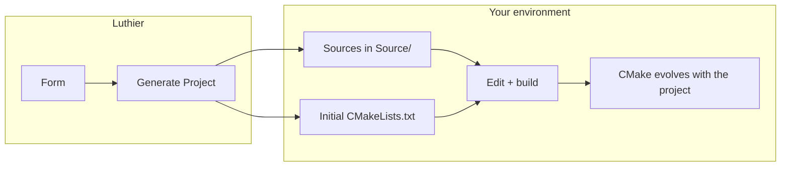

# Luthier User Manual

This manual is the reference document for **Luthier**: it first explains *why* the tool exists and how it fits into the JUCE/CMake ecosystem, then *how* to use it step by step — from your first generation to building in your IDE.

Luthier creates **ready-to-build JUCE starter projects** (AU/VST3 plugins and Standalone apps) for Windows, macOS, and Linux. You fill in a form, click **Generate Project**, then continue development in the environment of your choice. Luthier does not reopen or reload existing projects: one generation, then the handoff is yours (or your agentic IDE's).

Each section explains what a concept or setting is for first, then how to use it. To move fast: [Your first project in minutes](#7-your-first-project-in-minutes).

> **Interface language** — Luthier displays in **English**. All UI labels cited below match what you see on screen exactly. French edition: [manuel-utilisateur.md](manuel-utilisateur.md).

---

## Table of contents

**Part I — Context**

1. [Luthier at a glance](#1-luthier-at-a-glance)
2. [Creating a plugin or audio/MIDI app](#2-creating-a-plugin-or-audiomidi-app)
3. [JUCE and the ecosystem](#3-juce-and-the-ecosystem)
4. [Projucer and CMake: two approaches](#4-projucer-and-cmake-two-approaches)
5. [CMake by hand](#5-cmake-by-hand)
6. [Luthier scope and handoff to the IDE](#6-luthier-scope-and-handoff-to-the-ide)

**Part II — Getting started**

7. [Your first project in minutes](#7-your-first-project-in-minutes)
8. [Installing and running Luthier](#8-installing-and-running-luthier)

**Part III — Using Luthier**

9. [The main window](#9-the-main-window)
10. [Three kinds of settings for your JUCE projects](#10-three-kinds-of-settings-for-your-juce-projects)
11. [First launch](#11-first-launch)
12. [Project tab](#12-project-tab)
13. [Preferences tab](#13-preferences-tab)
14. [Templates tab](#14-templates-tab)
15. [About tab](#15-about-tab)
16. [Typical workflows](#16-typical-workflows)
17. [What Luthier generates](#17-what-luthier-generates)
18. [Where your data is stored](#18-where-your-data-is-stored)
19. [Field validation rules](#19-field-validation-rules)
20. [Path normalization](#20-path-normalization)
21. [Messages, errors, and troubleshooting](#21-messages-errors-and-troubleshooting)
22. [Using the standalone app](#22-using-the-standalone-app)
23. [Further reading](#23-further-reading)

---

## 1. Luthier at a glance

**Luthier** is a desktop application (Windows, macOS, Linux) that generates a complete **JUCE starter project** in one step: CMake files, starter C++ sources, plugin metadata, multi-platform presets. The result opens in Cursor, VS Code, Xcode, Visual Studio, or any CMake-compatible environment — and builds immediately without touching the initial configuration.

### What you get

| What Luthier gives you | Detail |
|------------------------|--------|
| **Fast start** | Projucer-inspired form → ready-to-build folder in minutes |
| **Cross-platform** | CMake presets for Windows, macOS (ARM, Intel, Universal…), and Linux |
| **Common formats** | AU, VST3, Standalone — according to your checkboxes |
| **Native CMake** | Compatible with modern IDEs, CI/CD, and agentic tools (Cursor, Antigravity, Claude Code…) |
| **Customization** | Persistent defaults, editable C++ templates, exportable profiles |

### What Luthier does

- Generates AU, VST3, and/or Standalone projects from a form ( **Project** tab).
- Writes `CMakeLists.txt`, `CMakeUserPresets.json`, sources, optional IDE helpers, and `.luthier.json` (snapshot written at generation — reference only; Luthier never reads it back).
- Stores your **default values** in `preferences.json` on your machine.
- Lets you customize **C++ source templates** (`PluginProcessor`, `PluginEditor`).
- Blocks generation into a **non-empty** folder; allows **session regenerate** (same session, same path) with a destructive confirm that preserves `.git`.

### What Luthier does not do

- **Reopen** or reload a project into the form — after generation, work in your IDE.
- **Compile** your project — CMake and your toolchain handle that.
- **Download or install** JUCE — you point at an existing SDK folder.
- **Sync** settings across machines — use **Export Preferences…** / **Import Preferences…**.

These limits are intentional: Luthier stays a **lightweight, predictable** starter generator. Sections [§5](#5-cmake-by-hand) and [§6](#6-luthier-scope-and-handoff-to-the-ide) explain why.

> **Takeaway** — Luthier saves you from day-zero setup. CMake and your IDE carry you from day one onward.

Repository: [github.com/tensquaresoftware/luthier](https://github.com/tensquaresoftware/luthier)

---

## 2. Creating a plugin or audio/MIDI app

Before opening Luthier, here is what creating an **audio plugin** (VST3, AU…) or a **standalone** audio/MIDI application for Windows, macOS, and Linux involves.

### Product types

| Type | Description | Typical formats |
|------|-------------|-----------------|
| **Audio plugin** | Processes or generates signal inside a DAW | **VST3**, **AU** (macOS), **Standalone** |
| **Standalone application** | Audio/MIDI app with a graphical interface | Native executable (`.app`, `.exe`…) |
| **Instrument / effect / MIDI effect** | Sub-types by role | VST3/AU categories set by JUCE |

### What you will need

| Item | Role |
|------|------|
| **JUCE SDK** | C++ framework — libraries and build tooling |
| **CMake 3.22+** | Describes *how* to compile the project |
| **C++ toolchain** | Compiler for your OS (Visual Studio, Xcode, GCC/Clang…) |
| **IDE or editor** | Cursor, VS Code, Xcode, Visual Studio… to code and launch builds |
| **Destination folder** | Where Luthier will create your project folder |

Each generated project's `README.md` lists exact prerequisites and build commands for your platform.

### CMake and IDE: two distinct roles

- **CMake** *configures* the build (which files to compile, JUCE path, output formats). Luthier generates these files for you.
- Your **IDE** *runs* that build. Cursor and VS Code with the **CMake Tools** extension are the most direct path: every Luthier project includes presets and tasks in `.vscode/`.

### Plugin formats (reminder)

- **VST3** — Windows, macOS, Linux
- **AU** (*Audio Unit*) — macOS only at compile time
- **Standalone** — self-contained plugin app; ideal for a first test without a DAW

---

## 3. JUCE and the ecosystem

### JUCE in brief

**JUCE** (*Jules' Utility Class Extensions*) is an open-source C++ framework and the reference stack for audio plugins and cross-platform audio applications. You write your business logic; JUCE provides the audio API, VST3/AU/Standalone wrappers, GUI, MIDI, and much more.

- Website: [juce.com](https://juce.com)
- Repository: [github.com/juce-framework/JUCE](https://github.com/juce-framework/JUCE)
- Licence: free for open source (AGPL) or commercial depending on use — [juce.com/legal](https://juce.com/legal)

Luthier generates projects that *use* JUCE but does not bundle it: install the SDK separately, then set its path in **JUCE directory** (see [§12.6](#126-workspace)).

### Alternatives to know

JUCE is not the only choice for audio plugins, but it is the most complete for a multi-format desktop project:

| Framework | Strengths | Limit vs Luthier |
|-----------|-----------|------------------|
| **[iPlug2](https://github.com/iPlug2/iPlug2)** | Lightweight, good for VST3/AU/CLAP, moderate learning curve | Smaller ecosystem and GUI than JUCE; Luthier does not target it |
| **[DPF](https://github.com/DISTRHO/DPF)** (*DISTRHO Plugin Framework*) | Minimal, open source, LV2/VST2/VST3/CLAP | Fewer all-in-one features; no rich built-in GUI like JUCE |

Luthier is designed **exclusively for JUCE + CMake**. If you choose iPlug2 or DPF, other generators or templates apply.

> **Note — CLAP and JUCE 9**  
> The **CLAP** format is gaining traction in the open-source ecosystem. JUCE 9 announces work in progress. As of this manual (2026), VST3 and AU remain the production references; watch [JUCE releases](https://github.com/juce-framework/JUCE/releases).

---

## 4. Projucer and CMake: two approaches

JUCE offers **tools** to structure your projects. Two philosophies coexist:

```
┌──────────────────────────────────────────────────────────────────┐
│                        PROJUCER                                  │
│  Source of truth = .jucer file (XML)                             │
│  Output = native IDE projects (Builds/Xcode, Builds/VS…)         │
│  Regeneration = rewrites IDE view on every Save                  │
└──────────────────────────────────────────────────────────────────┘

┌──────────────────────────────────────────────────────────────────┐
│                         CMAKE                                    │
│  Source of truth = CMakeLists.txt                                │
│  Output = build cache + binaries (Builds/…)                      │
│  Reconfigure = re-reads CMakeLists.txt, does not touch sources  │
└──────────────────────────────────────────────────────────────────┘
```

Both can produce the **same working plugin**. What changes is **who owns configuration** and **how the IDE resynchronizes**.

### Projucer: strengths and limits

**Projucer** is the application shipped with JUCE: configuration form + file explorer, not an IDE.

On **Save** or **Save and Open in IDE**, Projucer writes the `.jucer`, **regenerates** Xcode/Visual Studio/Makefile projects under `Builds/`, then opens the IDE. It does **not** produce `CMakeLists.txt`.

**Essential Projucer rule** — create and organize source files **from Projucer**, not directly in Xcode or Visual Studio. On every Save, Projucer rewrites the IDE project from the `.jucer`. A file added only in the IDE disappears from the build on the next Save.

| Limit | Consequence |
|-------|-------------|
| **No native CMake export** | Exporters for Xcode, VS, Makefile — not CMake |
| **IDE regeneration** | Every Save can overwrite changes made only in the IDE |
| **Single source of truth (.jucer)** | Hard to mix with an "IDE-first" workflow |
| **Modern IDEs not targeted** | Cursor, Antigravity, Claude Code… consume CMake + `compile_commands.json`, not `.xcodeproj` |

Projucer remains relevant for a classic "Xcode + Projucer" workflow. It becomes constraining when you want CMake, multi-IDE, CI/CD, or AI-assisted development.

### What the JUCE team recommends

> **For new projects, prefer CMake.**

- Documentation: [JUCE CMake API](https://github.com/juce-framework/JUCE/blob/master/docs/CMake%20API.md)
- Examples: [examples/CMake](https://github.com/juce-framework/JUCE/tree/master/examples/CMake)
- Functions: `juce_add_plugin`, `juce_add_gui_app`, etc.
- Projucer is still maintained, but no longer the preferred starting path

| CMake advantage | Detail |
|-----------------|--------|
| **IDE-agnostic** | Same project in Cursor, VS Code, CLion, or Terminal |
| **Industry standard** | Skill reusable outside JUCE |
| **No opaque regeneration** | You edit the build description; CMake reconfigures |
| **CI/CD** | GitHub Actions, cross-compilation |
| **Agentic coding** | AI reads and edits `CMakeLists.txt` like any text file |

---

## 5. CMake by hand

You can create a JUCE/CMake project **without Luthier** — by copying the [official examples](https://github.com/juce-framework/JUCE/tree/master/examples/CMake) or following the [CMake API](https://github.com/juce-framework/JUCE/blob/master/docs/CMake%20API.md). Here is what that involves.

### The two central files

**`CMakeLists.txt`** — the build plan: project name, JUCE path, sources to compile, plugin type, formats, JUCE modules, C++ options. **This file evolves with your project**; it is not set once and forgotten.

**`CMakeUserPresets.json`** — shortcuts to configure and build without retyping options (Debug/Release, OS, architecture). Luthier generates a full set; manually, you compose it yourself.

### Day-to-day CMake maintenance

| Situation | Typical action |
|-----------|----------------|
| New class / `.cpp` | Add the file to the source list |
| New resource (image, font) | Update `juce_add_binary_data` or equivalent |
| New JUCE module | Add `juce::juce_xxx` in `target_link_libraries` |
| Custom build option | Add commented `option()` or `set()` |

Then **reconfigure** CMake (often automatic with CMake Tools).

Unlike Projucer, your **source files are never overwritten** by reconfiguration — only the build cache is updated.

### If you are comfortable with the Terminal and command-line

CMake is fully driven from the CLI:

```bash
cmake --preset macos-debug-arm64      # configure
cmake --build --preset macos-debug-arm64   # build
```

A minimal editor + Terminal is enough if you accept less C++ autocompletion (without `compile_commands.json`) and command-line debugging (`lldb`/`gdb`). Most developers prefer an IDE or enriched editor that *consumes* the CMake files.

**Who maintains CMake over time?**

| Context | Approach |
|---------|----------|
| **Agentic IDE** (Cursor, Antigravity, Claude Code…) | AI updates `CMakeLists.txt` on request ("add this class to the build") |
| **Classic IDE** (VS Code + CMake Tools, CLion, Xcode…) | You edit `CMakeLists.txt` directly |

Both approaches are valid; the difference is *who* types the changes.

---

## 6. Luthier scope and handoff to the IDE

### Why Luthier exists

Starting a JUCE/CMake project **correctly configured** requires many decisions in the first minute: GarageBand-compatible plugin codes, multi-OS presets, formats, copy-to-system-folder options, C++ standard… Luthier condenses all of that into a **form** inspired by Projucer and produces a native CMake project directly.

### What Luthier does — and does not

| ✅ Luthier | ❌ Luthier does not |
|-----------|---------------------|
| Generates the **starter project** once | Reopen and reconfigure an existing project |
| Sets up CMake + presets + base sources | Manage the source tree as development progresses |
| Writes `.luthier.json` as an archive of initial metadata | Cleanly merge a complex `CMakeLists.txt` |
| Accelerates **day zero** | Replace Projucer for every scenario |

Building a "CMake Projucer" that reopens, edits characteristics, and resynchronizes the IDE **without breaking anything** would require merge mechanisms and protected zones in CMake — a major investment, comparable to community tools like [FRUT](https://github.com/McMartin/FRUT), plus a GUI layer. For an IDE- or AI-centred workflow, the effort/benefit ratio is not there.

Projucer reminder: every configuration or source-list change goes back through the application. With Luthier + CMake, **the source list and config evolve in the IDE** (or via AI), not in an external form.

### Where Luthier stops, development begins



1. **Generate Project** writes the initial structure to disk.
2. Your **sources** live in `Source/` (and elsewhere) — created **from your IDE**, freely.
3. Your **`CMakeLists.txt` evolves** — by you, or by AI in an agentic IDE.
4. Do **not** run Generate again on a developed project (except intentional session regenerate — see [§16.3](#163-session-regenerate-same-app-session)): it would overwrite accumulated work.
5. **Reconfigure CMake** when the build description changes.

### Working with an agentic IDE or AI

In Cursor, Antigravity, or Claude Code, an instruction like:

> *"Create class `FooBar` in `Source/Core/` and add it to the build"*

typically causes: creation of `.h`/`.cpp`, update of the source list in `CMakeLists.txt`, project reconfiguration. That is **smoother** than returning to a generator — especially when the project has hundreds of files, BinaryData blocks, tests, or post-build hooks.

The `.luthier.json` file remains a **snapshot** of initial choices (name, codes, paths…). Useful as reference for you or for AI; Luthier does not read it back.

Manual `CMakeLists.txt` management remains fully possible — it is the standard JUCE/CMake community workflow.

### Which path to choose?

| Criterion | Projucer + native IDE | Manual CMake | **Luthier → CMake** |
|-----------|----------------------|--------------|---------------------|
| Getting started | Fast | Slow | **Fast** |
| Cursor / agentic IDE | No (natively) | Yes | **Yes** |
| Multi-IDE / CI | Limited | Yes | **Yes** |
| Sources over time | From Projucer | From IDE | **From IDE** |
| Reconfigure later | Via Projucer | Edit CMake | **Edit CMake / AI** |

---

## 7. Your first project in minutes

From zero to a compiling Standalone app — steps in order.


**Step 0 — Install JUCE (once per machine)**

1. Download JUCE from [juce.com](https://juce.com) or clone [github.com/juce-framework/JUCE](https://github.com/juce-framework/JUCE).
2. Place the folder in a stable location:
   - macOS: `/Applications/JUCE`
   - Windows: `C:/Program Files/JUCE`
   - Linux: `/usr/local/JUCE`

**Step 1 — Launch Luthier and set Preferences**

1. Open Luthier → **Preferences** tab.
2. Set **Manufacturer** (e.g. `My Studio`).
3. Under **Workspace**, for **your current OS**:
   - **Destination folder** → **Choose…** → pick a parent folder (e.g. `~/Documents/Plugins`).
   - **JUCE directory** → **Choose…** → select the JUCE folder from step 0.
4. Leave AU, VST3, and Standalone checked — **Standalone** is the simplest first test.

**Step 2 — Generate the project**

1. **Project** tab → **Project name**: `MyFirstPlugin`.
2. Click **Generate** next to **Plugin code**.
3. Click **Generate Project** — the status bar confirms the path.

**Step 3 — Build (Cursor or VS Code)**

1. Install [Cursor](https://cursor.com) or [VS Code](https://code.visualstudio.com) + **CMake Tools** extension.
2. **File → Open Folder** → open the generated `MyFirstPlugin` folder.
3. Wait for CMake configuration; pick a preset:
   - macOS Apple Silicon: `macos-debug-arm64`
   - Windows: `windows-debug`
   - Linux: `linux-debug`
4. Build: **Ctrl+Shift+B** / **Cmd+Shift+B**, or command palette → **CMake: Build**.

**Step 4 — Test**

The **Standalone** format produces an `.app`, `.exe`, or binary you can run directly — no DAW required. Typical path: `Builds/…/Standalone/` (details in the project's `README.md`).

**Other IDEs** — Xcode and Visual Studio work too; the generated `README.md` also documents Terminal commands. The `.vscode/` folder and `.cursorrules` file are optional.

**If you get stuck** — verify **JUCE directory**, CMake 3.22+, then [§21](#21-messages-errors-and-troubleshooting).

---

## 8. Installing and running Luthier

Choose the path that matches how you use Luthier. If you received an installer or archive, prefer the standalone app. If you work in the Luthier repository itself, follow the developer setup.

Luthier runs on **Windows**, **macOS**, and **Linux** — from source (Python + PySide6) or as a **standalone app** (PyInstaller). The interface is identical; only installation differs.

On **macOS**, the standalone `Luthier.app` requires **Apple Silicon** (arm64). Intel-based Macs are not supported for the app. Generated JUCE projects can still be built for Mac Intel (CMake presets `macos-debug-x86_64`, `macos-release-x86_64`).

### From source (developers)

This path requires Python 3.11+ and a virtual environment. See [CONTRIBUTING.md](../../CONTRIBUTING.md) in the repository for full setup. In short:

```bash
python3 -m venv .venv
source .venv/bin/activate          # Windows: .venv\Scripts\activate
pip install -r requirements-dev.txt
.venv/bin/python main.py           # Windows: .venv\Scripts\python main.py
```

### Standalone app (end users)

Download or build the bundle for your system, then launch the app like any native application — no Python installation required on the machine. Project templates and GUI libraries are bundled in the distributed folder — see [§22](#22-using-the-standalone-app) for platform-specific details.

---

## 9. The main window

Luthier's interface is deliberately simple: one tab per major task, a central form, and action buttons at the bottom. Take a moment to locate the four areas below. They come back throughout this manual.

When Luthier opens, you see:

```
┌──────────────────────────────────────────────────┐
│  Project │ Preferences │ Templates │ About       │  ← Tab bar
├──────────────────────────────────────────────────┤
│                                                  │
│              Active tab content                  │  ← Scrollable form or editor
│                                                  │
├──────────────────────────────────────────────────┤
│        Status message (centred, full width)      │  ← Dedicated status bar
├──────────────────────────────────────────────────┤
│          [Action buttons for this tab]           │  ← Action bar
└──────────────────────────────────────────────────┘
```

### Tab bar

| Tab | Purpose |
|-----|---------|
| **Project** | Configure the JUCE project you are working on. |
| **Preferences** | Edit global defaults that pre-fill new projects. |
| **Templates** | View and customize the C++ / `.gitignore` templates used at generation time. |
| **About** | Credits, version, and links. |

### Status line

The status line is your main feedback after an important action (generation, import). After most operations, a short message appears in a **dedicated bar above the action buttons**, centred across the full window width:

- **Success** messages use the **accent colour** (customizable — magenta by default).
- **Error** messages use red.
- Long paths wrap to multiple lines instead of crowding the buttons.

Examples: *"Project generated at /Users/you/Documents/MySynth"*, *"Project regenerated at …"*, *"Preferences imported from client-a.json"*.

Preferences auto-save shows a small **Saved** badge on the edited field only — it does not use this global status bar.

### Action bar

The buttons at the bottom **change with the active tab**:

| Tab | Buttons |
|-----|---------|
| **Project** | **Create New Project**, **Generate Project** |
| **Preferences** | **Import Preferences…**, **Export Preferences…** |
| **Templates** | **Load from file…**, **Reset to default**, **Save override** |
| **About** | *(none)* |

### Window size and position

Luthier remembers window size and maximized state between sessions. On **macOS** and **Windows**, position is restored as well. On **Linux**, size is usually restored; **position is not guaranteed** (especially under Wayland, where the window manager may ignore client-requested placement). If the saved geometry is no longer valid (for example you unplugged a monitor), the window opens centred at a comfortable default size.

---

## 10. Three kinds of settings for your JUCE projects

The most common source of confusion for new users is mixing up **the current JUCE project**, **default values**, and **starter source code**. Luthier keeps these three areas in separate tabs. The table below summarises the logic.

Understanding this distinction answers most questions like "I changed Preferences — why didn't my Project tab update?"

| Area | Tab | Scope | Answers the question |
|------|-----|-------|----------------------|
| **Current project** | Project | One JUCE project at a time | *How is **this** JUCE project configured?* |
| **Global defaults** | Preferences | Whole app, all future projects | *What values should I reuse every time?* |
| **Global templates** | Templates | Whole app, all generated projects | *What boilerplate source code should new projects start from?* |

**Important rules:**

- Editing **Preferences** does **not** change the **Project** tab until you click **Create New Project** (or restart the app for the initial population).
- **Generate Project** never writes to `preferences.json`.
- Customizations on the **Templates** tab apply on every **Generate Project**. However, **Export Preferences…** only exports the **Preferences** profile. Template overrides stay in Luthier's `templates/` config folder (see [§18](#18-where-your-data-is-stored)). Copy them separately when you move machines.

In short: **Preferences** and **Templates** prepare the future. **Project** describes the JUCE project you are working on *right now*. Generation reads **Project** (and templates) only — never the other way around.

---

## 11. First launch

On the very first start, Luthier initialises a local profile with sensible factory defaults. You can generate a project right away, but spending a few minutes in **Preferences** (manufacturer, paths, JUCE) will save time on every JUCE project after that.

### What happens automatically

1. Luthier creates **`preferences.json`** in your OS application config folder (first run only).
2. Factory defaults are written — see the table below.
3. The **Project** tab opens as a **new project**: identity fields empty, everything else copied from preferences.

### Factory defaults (first `preferences.json`)

| Setting | Initial value |
|---------|---------------|
| Manufacturer | `My Company` |
| Manufacturer code | `Myco` |
| Plugin code | `Mypl` |
| Copyright, Website, E-mail | empty |
| Workspace — Destination folder (Windows / macOS / Linux) | host OS → your **Desktop**; other platforms → empty |
| Workspace — JUCE directory (Windows / macOS / Linux) | empty (placeholder hints per OS on the host row, e.g. `/Applications/JUCE` on macOS) |
| Plugin type | Instrument (Synth) |
| Formats | AU, VST3, Standalone — all checked |
| C++ standard | C++17 |
| Preprocessor defs, Header search paths | empty |
| Copy to system plugin folders | off |
| Copy to central artefacts folder | off |
| Artefact paths (Windows / macOS / Linux) | empty |
| **Accent colour** (`accentColor`) | Magenta (`#A45C94`) — Projucer-inspired default |

### Recommended first steps

1. Open **Preferences** and set your **Manufacturer**, codes, and **Workspace** paths.
2. Switch to **Project**, enter a **Project name**, then click **Generate Project**.
3. Open the generated folder in your IDE and follow the project's `README.md`.

For a full step-by-step guide, see [§7 — Your first project in minutes](#7-your-first-project-in-minutes).

---

## 12. Project tab

This is where you describe **one** JUCE project: its name, identity, formats, compilation options, and where binaries go after a build. Think of this tab as the "identity sheet" for the project Luthier will write to disk.

The tab is one scrollable page divided into sections. Fields marked with an asterisk (*) are required. Luthier flags errors as you type and keeps **Generate Project** disabled until the form is valid.

### 12.1 Project Info

This section covers the plugin **identity**: names, version, manufacturer, and codes. Manufacturer and plugin codes may look cryptic at first: they matter mainly for macOS hosts (Audio Unit) and must follow strict rules — hence the **Generate** button and the table below.

| Field | Required | Description |
|-------|----------|-------------|
| **Project name** * | Yes | Technical name — folder name and CMake target. Must start with a letter. Letters, digits, `-`, `_` only. |
| **Display name** | No | Name shown in hosts (DAW, Standalone app). Letters, digits, spaces, `-`, and `_` allowed (e.g. `My Synth 1`). If empty, **Project name** is used. |
| **Version** * | Yes | Plugin version string (default `1.0.0` for new projects). |
| **Manufacturer** * | Yes | Your company or personal name. |
| **Copyright** | No | Copyright line in generated metadata. |
| **Website** | No | Optional URL. |
| **E-mail** | No | Optional contact. |
| **Manufacturer code** * | Yes | GarageBand-compatible AU code: first **uppercase** letter, then three **lowercase** letters (e.g. `Myco`). **Generate** button fills a random valid code. |
| **Plugin code** * | Yes | GarageBand-compatible AU code: first **uppercase** letter, then three **lowercase** letters or digits (e.g. `Mypl`, `Dem0`). `DEMO` is reserved by Apple. Same **Generate** button as manufacturer code. |
| **Bundle ID** | — | Read-only. Computed from manufacturer + project name. |

Where to create the project and where JUCE lives are configured in [§12.6 Workspace](#126-workspace), not here.

### 12.2 Plugin Type

The plugin type determines how JUCE wires audio and MIDI inputs/outputs in the generated processor. You can pick only **one** at a time. Change it before the first generation if needed, or regenerate after editing.

Pick exactly one:

| Type | Meaning |
|------|---------|
| **Instrument** (Synth) | Receives MIDI, produces audio. |
| **Audio Effect** | Processes incoming audio. |
| **MIDI Effect** | Processes MIDI only — no audio I/O. |

### 12.3 Plugin Characteristics

Below **Plugin Type**, the **Plugin Characteristics** section controls how JUCE wires audio/MIDI buses in the generated `CMakeLists.txt` and `PluginProcessor.cpp`. Options are **preset-constrained** per plugin type — unavailable checkboxes stay disabled.

| Control | Description |
|---------|-------------|
| **Plugin is a Synth** | Synth flag (Instrument preset). |
| **Plugin MIDI Input** | Enables MIDI input. |
| **Plugin MIDI Output** | Enables MIDI output (e.g. Instrument + MIDI Output for an instrument that sends MIDI to the host). |
| **MIDI Effect Plugin** | MIDI-effect flag (MIDI Effect preset). |
| **Editor Requires Keyboard Focus** | Keyboard focus for the plugin editor. |
| **Audio I/O** | Preset combo: **Stereo**, **Mono**, **Synth No Input**, **MIDI Effect** (no audio buses). |
| **VST MIDI Inputs** / **VST MIDI Outputs** | Dropdowns **1–16** when the corresponding MIDI checkbox is enabled. |
| **Plugin Description** | Maps to CMake `DESCRIPTION` in the generated project. |

**Preset hints:**

- **Instrument** — MIDI Output can be enabled for instruments that send MIDI to the host.
- **Audio Effect** — MIDI Input or Output optional for MIDI-driven effects.
- **MIDI Effect** — characteristics fixed by the preset; **Synth** and **MIDI Effect Plugin** together are invalid.

Generated bus layout reflects these choices — not the plugin type alone.

### 12.4 Formats

Formats define **what shape** your JUCE project is built as: a DAW module (AU, VST3) or a desktop app (Standalone). Check at least the one you plan to test first. You can add others later with **Regenerate Project** in the **same Luthier session** (same path), or by editing `CMakeLists.txt` manually after generation.

Select **at least one**:

- **AU** (Audio Unit, macOS compatible only)
- **VST3** (Virtual Studio Technology, Windows/macOS/Linux compatible)
- **Standalone**

If none are checked, **Generate Project** stays disabled and a hint appears under the checkboxes.

**Note:** AU is only built on macOS. On Windows and Linux, CMake drops that format at build time. Leaving the checkbox enabled keeps AU in the project for when you open it on a Mac later without regenerating.

### 12.5 Compilation

These settings are passed through to the generated `CMakeLists.txt`. For a first project, the defaults (C++17, empty fields) are usually fine. Come back here when you need preprocessor flags or extra header search paths.

| Field | Description |
|-------|-------------|
| **C++ standard** | C++17, C++20, or C++23. |
| **Preprocessor defs** | One definition per line (e.g. `MY_FLAG=1`). |
| **Header search paths** | One path per line, relative to the project root. |

**Preprocessor defs** — C++ macros passed to the compiler (one per line). Useful for conditional code (`MY_DEBUG=1`) without editing CMake by hand. Luthier injects them into `CMakeLists.txt` as `target_compile_definitions`.

**Header search paths** — extra header folders the compiler should know about, **relative to the project root** (e.g. `libs/my-sdk/include`). Luthier injects them as `target_include_directories`.

### 12.6 Workspace

Before you generate, Luthier needs to know **where on disk** this project lives and **where JUCE is installed** — on **each** operating system you might use. **Workspace** sits at the bottom of the form, just above **Artefacts**: first you configure the plugin, then your local folders, then optional artefact copy targets.

| Group | Required | Description |
|-------|----------|-------------|
| **Destination folder** * | Host OS only | **Parent** folder where Luthier creates the project subfolder named after **Project name**. Example on macOS: `~/Documents` + `MySynth` → `~/Documents/MySynth`. Three rows: **Windows**, **macOS**, **Linux**. |
| **JUCE directory** | No (host) | Path to the JUCE SDK **for this project** on each OS. Pre-filled from Preferences on a new project. Can differ per project (multiple versions or copies of JUCE). Three rows: **Windows**, **macOS**, **Linux**. |

Each group uses **tree-style connectors** (decorative vertical lines) to visually group the three OS rows. Tab order is unchanged — connectors are grouping only:

```
Destination folder *
│
├─ Windows     [________________]
├─ macOS       [________________]  [Choose…]
└─ Linux       [________________]
```

The same pattern applies to **JUCE directory** under **Workspace**.

The row for **your current OS** has **Choose…** (native folder picker). The other two rows are typed or pasted manually — a picker on your machine cannot produce a valid path for another OS. Layout: **label → Choose… (host only) → text field**. Paths are normalized to forward slashes — see [§20 Path normalization](#20-path-normalization).

**At generation time**, only the **host OS** values are used. The other paths are stored in `.luthier.json` as a snapshot for reference on other machines — edit host paths manually in the sidecar or Preferences before a **new** generate if needed.

#### Cross-platform setup (example)

| OS | Destination folder | JUCE directory |
|----|-------------------|----------------|
| macOS | `/Users/you/Documents/Plugins` | `/Users/you/Dev/SDKs/JUCE` |
| Windows | `C:/Users/you/Documents/Plugins` | `C:/Users/you/Dev/SDKs/JUCE` |
| Linux | `/home/you/Documents/Plugins` | `/home/you/Dev/SDKs/JUCE` |

Configure these once in **Preferences → Workspace**, **Export Preferences…**, then import on each machine. Per-project overrides live in **Project → Workspace** and are written to `.luthier.json` at generate.

### 12.7 Artefacts

After each successful build, you often want to **find the built binary** (plugin or Standalone) without digging through `Builds/` folders. This section configures two complementary mechanisms: copy to DAW scan locations, and copy to a central folder you define.

This mechanism centralizes your projects' compiled binaries in a single folder, organized by platform and architecture, so you can find, archive, or prepare them for distribution without digging through each project's build directory.

The options below are injected into CMake cache variables at generation time. Actual build-time behaviour is documented in the generated project's `README.md`.

| Option | Description |
|--------|-------------|
| **Copy to system plugin folders** | Copy to standard DAW scan locations — handy for testing the result right after a build. |
| **Copy to central artefacts folder** | When checked, enables the three directory fields below. |

When **Copy to central artefacts folder** is on, the three per-OS path rows use the same tree connector pattern as **Workspace** (anchored under the checkbox):

```
Copy to central artefacts folder  [✓]
│
├─ Windows     [________________]
├─ macOS       [________________]  [Choose…]
└─ Linux       [________________]
```

| Field | Description |
|-------|-------------|
| **Windows** | Target path used on Windows builds. |
| **macOS** | Target path used on macOS builds. |
| **Linux** | Target path used on Linux builds. |

The path for **your current OS** has a **Choose…** button. The other two are typed or pasted manually, because a folder picker on your machine cannot produce a valid path for another OS (for example `D:\Plugins` while running on macOS). It is fine to leave the other fields empty if you develop on a single platform for now.

#### Cloud and shared storage (Dropbox, OneDrive, NAS…)

A practical setup is to point each path at the **same logical folder** inside a cloud or network sync service — for example `Dev/Artefacts/JUCE` within your Dropbox, OneDrive, or NAS mount. You still enter **three paths** (one per OS), because each system expresses that location differently:

| OS | Example path |
|----|----------------|
| macOS | `/Users/you/Dropbox/Dev/Artefacts/JUCE` |
| Windows | `C:\Users\you\Dropbox\Dev\Artefacts\JUCE` |
| Linux | `/home/you/Dropbox/Dev/Artefacts/JUCE` |

After each successful build, **CMake** (via the generated project, not Luthier) may copy binaries into **platform subfolders** under that root: `macOS/` (with an architecture subfolder such as `ARM/` or `Universal/`), `Windows/`, and `Linux/`. When you build the same project on several machines, sync merges those branches into one tree — useful for archiving or preparing a release without manual sorting:

```
Dev/Artefacts/JUCE/
├── macOS/
│   ├── ARM/
│   │   ├── AU/
│   │   └── VST3/
│   └── Universal/
├── Windows/
│   └── VST3/
└── Linux/
    └── VST3/
```

Typical workflow: create the project on one machine and set the artefact path with the **Choose…** button. Clone the repository on your other systems, edit host paths in `.luthier.json` or **Preferences** if needed, and build with CMake on each OS.

Artefact settings belong to **this project**. They may differ from your global Preferences defaults.

### 12.8 Project actions

Two buttons structure project workflow in Luthier: start from a blank form, or write the displayed configuration to disk. Confusing them with IDE editing is a frequent source of mistakes.

#### Create New Project

Use this when you want to **start another JUCE project** without wiping your global defaults. It resets the form:

- **Cleared:** project name, display name (version reset to `1.0.0`).
- **Re-populated from `preferences.json`:** everything else — manufacturer, codes, workspace paths, type, formats, compilation, artefacts.

If you edited the form since the last stable state (reset or cold start), Luthier asks:

> *The project form has unsaved changes. Discard them and start a new project?*

**No** keeps your edits. **Yes** resets. The default button is **No**.

**Create New Project** does **not** modify `preferences.json`.

#### Generate Project

This is the step that **actually writes files** to disk (CMake, sources, companion file, optional IDE helpers). Until you click it, form changes exist only inside Luthier.

Creates the project from the **Project** tab only:

- writes to the **host** **Destination folder** / **Project name** (folder must be **empty**, unless session regenerate applies — see below).
- embeds the **host** **JUCE directory** in `CMakeLists.txt` when set.
- applies your **Templates** overrides if any.
- writes `.luthier.json`, a **write-only** sidecar with a configuration snapshot (Luthier never reads it back).

**Generate Project** does **not** read or write **Preferences**.

**Destination folder behaviour:**

- If the **host** destination is empty or points to a non-existent folder, Luthier opens a folder picker before continuing.
- If `{destination}/{projectName}/` already exists and is **non-empty** (including hidden files like `.git/` or `.DS_Store`):
  - **Fresh app session** or **different path** → **blocked** with error dialog and status message: *"This folder already exists and is not empty. Luthier only creates new projects. Choose an empty folder or a different project name."*
  - **Same app session** after a successful **Generate Project** to the **same resolved path** → **Regenerate Project** confirm dialog (default **No**): replaces everything except `.git`; Finder/IDE edits since last generate are lost.
- After app **restart**, a brownfield folder is **protected** — delete manually or pick an empty destination.

After a successful generation, Luthier remembers the **host** destination parent folder for the next **Choose…** dialog.

**Generate Project** is enabled only when all required fields are valid and templates are available.

---

## 13. Preferences tab

The **Preferences** tab saves you from retyping the same information for every new JUCE project: default manufacturer, codes, **Workspace** paths, default formats, and so on. It is **not** where you name a specific project. That stays in **Project**.

### 13.1 Sections

At the top of the tab, **Luthier appearance** lets you pick one of **twelve preset accent colours** for the Luthier interface. This is the **only** accent picker in the app — there is none on the **Project** tab. The choice is saved immediately to `preferences.json` (`accentColor`) and included in **Export Preferences…** / **Import Preferences…**. It is **not** written to `.luthier.json`.

Changing the accent updates the theme on **all tabs** immediately. Accent colour affects Luthier's UI only — not generated JUCE files.

| Section | Contents |
|---------|----------|
| **Identity** | Manufacturer, codes (each with **Generate**), Copyright, Website, E-mail |
| **Plugin Type** | Default Instrument / Audio Effect / MIDI Effect |
| **Formats** | Default AU / VST3 / Standalone checkboxes |
| **Compilation** | Default C++ standard, preprocessor defs, header paths |
| **Workspace** | **Destination folder** and **JUCE directory** per OS (**Choose…** for the host OS, text entry for the other two) |
| **Artefacts** | Same copy options and per-OS paths as Project (**Choose…** for the host OS, text entry for the other two) |

There are **no** project-specific fields here (no project name, version, or bundle ID). If you edit Preferences while a project form is already displayed in **Project**, it is normal that the Project screen does not change — click **Create New Project** to see the new defaults on a fresh form.

### 13.2 Auto-save

Unlike many applications, Luthier has no **Save** button in Preferences: every valid field is **saved immediately** to `preferences.json`. You can close the app without worrying about forgetting to save, as long as the field shows no error.

When a field saves, a small **"Saved"** badge flashes briefly on that field (using the current accent colour).

Invalid fields block saving until corrected.

### 13.3 Import Preferences…

Import **replaces** your entire local profile with a previously exported JSON file — useful for restoring a backup or switching between profiles (clients, machines, studios).

1. Choose a JSON file (exported profile, backup, another machine).
2. If valid, it **replaces** the entire current preferences profile and updates `preferences.json` (including **`accentColor`** when present in the file).
3. The Preferences tab reloads; the imported accent colour applies immediately on **all tabs**.

**Import does not change the Project tab**. Use **Create New Project** to apply the new defaults — accent colour included — to a fresh form.

If the file is invalid, an error dialog appears and your previous profile is kept.

### 13.4 Export Preferences…

Export creates a **copy** of your current preferences in a file you choose. The local `preferences.json` is not modified. You can export several named profiles (`client-a.json`, `client-b.json`, `home.json`, etc.) and reimport them later.

The exported JSON contains the same fields as your live profile, including **`accentColor`**, so appearance and defaults travel together when you move or switch profiles.

Use this to back up profiles or share them between machines (one file per client, per studio, etc.).

Export is blocked if any preference field is currently invalid.

### 13.5 Multi-client workflow

If you develop for several brands or clients, export one profile per context and import it before each new JUCE project. You keep manufacturer codes, paths, metadata, and a **distinct accent colour** consistent without retyping everything — and you can spot the active client at a glance from the UI colours.

1. Configure **Preferences** for **Client A** (defaults + **Luthier appearance**) → **Export Preferences…** → `client-a.json`.
2. Repeat for **Client B** with a different colour → `client-b.json`.
3. Before starting a JUCE project for a client → **Import Preferences…** → pick the right file (accent and fields update in **Preferences**).
4. **Create New Project** → form matches that profile.

The current **Project** form stays unchanged until you click **Create New Project**.

---

## 14. Templates tab

Templates are the **model source files** Luthier copies into every new project: audio processor (`PluginProcessor.h/.cpp`), editor UI (`PluginEditor.h/.cpp`), `.gitignore`. Customise them once here if you want all future JUCE projects to start from **your own starter code** (usual includes, class layout, Git rules, etc.).

Templates are **global**: the same files are used for **every** project you generate.

### Editable files

| File | Role |
|------|------|
| `PluginProcessor.h` / `.cpp` | Main audio/MIDI processor starter template |
| `PluginEditor.h` / `.cpp` | Plugin editor UI starter template |
| `.gitignore` | Git ignore rules for new projects |

Select a file from the dropdown, edit in the syntax-highlighted editor, then **Save override** to persist your version. Until you save the override, your edits will not be used at generation time. Remember **Save override** before leaving the tab.

### Actions

| Button | Effect |
|--------|--------|
| **Load from file…** | Loads an external file into the editor **without saving**. Use **Save override** to persist. |
| **Reset to default** | Removes your override. The built-in Luthier template is restored. |
| **Save override** | Stores the editor content as your personal override. |

Status line under the editor:

- *"Override active — used for new projects."* when you have a custom version.
- *"Showing the built-in default."* otherwise.

Overrides are stored in the `templates/` subfolder of Luthier's config directory, **separate from** `preferences.json`. Importing preferences does **not** import template overrides. If you move to another machine, export/import prefs and copy or recreate your template overrides if needed (see [§18](#18-where-your-data-is-stored)).

If you customize `PluginProcessor.cpp`, retain the `@CREATE_BUSES_PROPERTIES_BODY@` token unless you replace bus creation entirely — Luthier injects generated bus properties at that placeholder during **Generate Project**.

---

## 15. About tab

Informational tab: Luthier version, credits, and useful links. No effect on your projects.

Use the e-mail and GitHub links to contact the author and visit their GitHub page.

---

## 16. Typical workflows

The scenarios below cover the most common combinations. Each assumes Luthier is installed and you have at least set **Workspace** paths in **Preferences** (host **JUCE directory** at minimum).

### 16.1 Brand-new JUCE project (one JUCE install)

The most common case: one JUCE SDK per machine, one destination folder, several JUCE projects in a row with the same defaults.

1. Set **Preferences** once (manufacturer, **Workspace** paths for your OS).
2. On **Project**, enter **Project name** and adjust options (generate a unique **Plugin code** per project).
3. Click **Generate Project**.
4. Open the output folder in your IDE. Follow the generated `README.md` to configure and build with CMake.

For another JUCE project: **Create New Project** → adjust → **Generate Project**.

### 16.2 JUCE project with a specific JUCE version

Useful when this project must stay on a JUCE branch or version different from your other projects. The SDK path is stored **in the project** (per OS in **Workspace**), not only in Preferences.

1. **Create New Project** (Workspace JUCE paths populated from Preferences).
2. Change the **host** **JUCE directory** row in **Workspace** on the **Project** tab to the branch or copy you need.
3. **Generate Project** — the SDK path is stored in the project and the companion file `.luthier.json`.

### 16.3 Session regenerate (same app session)

You generated successfully **in this session** and want to change the form (characteristics, version, paths) and **regenerate the project**:

1. Edit fields on **Project**.
2. Click **Generate Project** again → **Regenerate Project** confirm dialog (default **No**).
3. On **Yes**, Luthier replaces the project tree except `.git`. Finder/IDE edits since the last generate are lost.

After **app restart**, the same folder is **blocked** (non-empty guard) — delete the folder manually or use a different project name/destination.

### 16.4 After generation (continue in IDE)

Once the **project is generated**, Luthier's job is done for it:

1. Open the project folder in your IDE or Cursor.
2. Edit `Source/`, `CMakeLists.txt`, and other files as needed.
3. Reconfigure and build with CMake presets (see the generated `README.md`).
4. Do **not** run **Generate Project** on an evolved project unless you intend a full replace — and only **in the same session** with confirm (see §16.3).

### 16.5 Switch client profile between projects

Typical flow for a freelance or multi-brand developer: import the right JSON (defaults **and accent colour**), create a fresh form, generate.

1. **Import Preferences…** → client profile JSON (fields and accent colour updated in **Preferences**).
2. **Create New Project**.
3. Fill identity fields → **Generate Project**.

Your previous **Project** form is untouched until **Create New Project**.

### 16.6 Customize starting source code

Do this once before a batch of generations: your template overrides will be injected into **all** new projects generated afterwards.

1. Open **Templates** → select `PluginProcessor.cpp` (or another file).
2. Edit → **Save override**.
3. **Generate Project** on a new project — your override is used.

### 16.7 Same project on macOS, Windows, and Linux

For a Git-shared project built on several machines:

1. On your main machine, fill all six **Workspace** paths in **Preferences** (or on **Project** after **Create New Project**), then **Export Preferences…** if you reuse the same layout across projects.
2. **Generate Project** and push the repo (`.luthier.json` carries all six paths as reference metadata).
3. On each other OS: `git clone` → edit host **JUCE directory** (and destination if needed) in `.luthier.json` or **Preferences** before a **new** generate → build with CMake on each platform.
4. Optionally set **Artefacts** paths the same way (see [§12.7](#127-artefacts)).

---

## 17. What Luthier generates

When you click **Generate Project**, Luthier creates a folder named after **Project name** inside the **host** **Destination folder** from **Workspace**. The example below shows a typical layout. Exact files depend on the formats checked and the target platform.

Given a valid **Project name** `MySynth` and a **host** **Destination folder** `~/Documents`, Luthier creates `~/Documents/MySynth/` containing:

| Output | Description |
|--------|-------------|
| `CMakeLists.txt` | Main JUCE CMake project |
| `CMakeUserPresets.json` | Multi-platform CMake presets (debug/release per OS) |
| `Source/` | Processor and editor `.h` / `.cpp` from templates |
| `.luthier.json` | Write-only sidecar: configuration snapshot at generate (form fields, Workspace paths, plugin characteristics — **no** `accentColor`) |
| `.gitignore` | From template (customizable) |
| `.vscode/` and `.cursorrules` | **Optional** helpers for VS Code and Cursor (CMake presets, build tasks, suggested extensions). Safe to ignore or delete if you use Xcode, Visual Studio, or another IDE. |
| `CMake/CopyVst3Elevated.ps1` | Windows VST3 copy helper |
| `README.md` | Generated project readme |

Generation uses atomic writes: files are built in a temporary folder and swapped in place to reduce the risk of a half-written project.

The generated `README.md` in the project folder documents prerequisites (CMake, compiler, Ninja), CMake presets per platform, and artefact copy behaviour — start there for your first build.

---

## 18. Where your data is stored

Luthier splits data between **application configuration** (defaults, templates, window state) and **each generated project folder**. Knowing what lives where helps with backups, moving machines, or understanding why a setting "comes back" after an action.

| Location | Contents | Changed by |
|----------|----------|------------|
| `preferences.json` | Global defaults profile (`accentColor`, manufacturer, paths, …) | First launch, Preferences auto-save, **Luthier appearance** picker, Import |
| `app_state.json` | Last destination parent, last import/export folder, window geometry | Import/Export paths, window resize/move |
| *(in-memory only)* | Last generated project path for **session regenerate** (same Luthier session) — **not** written to disk | Successful **Generate Project**; cleared when the app exits |
| Exported `*.json` files | Preference profile copies (including `accentColor`) | Export Preferences… (manual files you choose) |
| Template overrides (`templates/`) | Custom template content | Save override, Reset |
| Generated project folder / `.luthier.json` | CMake project + write-only sidecar (form fields, Workspace, characteristics — **no** accent) | Generate Project |

Typical **Luthier config directory** locations:

| Platform | Path |
|----------|------|
| Windows | `%LOCALAPPDATA%\Luthier\` (e.g. `C:/Users/You/AppData/Local/Luthier/`) |
| macOS | `~/Library/Preferences/Luthier/` |
| Linux | `~/.config/Luthier/` |

You will find `preferences.json`, `app_state.json`, and the `templates/` subfolder ( **Templates** tab overrides) there.

**Key idea:** global settings live in this config directory on your machine. Per-project settings live in the **Project** tab while you edit, then in the project folder and the write-only sidecar `.luthier.json` after generation. Luthier **never** reads `.luthier.json` back into the form. To share a project with a colleague, send the **project folder**. To share your usual form values, export **Preferences**.

---

## 19. Field validation rules

Luthier validates fields **as you type** rather than only when you click Generate: errors appear next to the field and **Generate Project** stays greyed out until the form is fully valid. This is guidance, not an arbitrary lock. Fix the flagged field and the button re-enables.

| Field | Rule |
|-------|------|
| Project name | Starts with a letter. Only letters, digits, `-`, `_`. |
| Display name | Letters, digits, space, `-`, `_` only (e.g. `My Synth 1`). |
| Version | Non-empty. |
| Manufacturer | Non-empty. |
| Manufacturer code | First uppercase letter, then 3 lowercase letters (GarageBand AU). |
| Plugin code | First uppercase letter, then 3 lowercase letters or digits (GarageBand AU). `DEMO` is reserved. |
| Destination folder (host OS) | Non-empty on the machine you generate from. No accented characters in the path. |
| JUCE directory (host OS) | Optional. If set, no accented characters. |
| Workspace paths (non-host OS) | Optional. If set, no accented characters. |
| Formats | At least one checked. |
| Artefact paths | When central copy is enabled, paths must not contain accented characters. |

Optional text fields (Copyright, Website, E-mail, preprocessor defs) accept any content unless otherwise noted.

**Plugin identity codes** — Luthier enforces the casing rules required by GarageBand 10.3 and recommended by JUCE for Audio Unit plugins. This avoids a common pitfall: the project builds successfully, but the AU plugin does not appear in GarageBand because the codes used the wrong case (e.g. all lowercase or all digits). Use **Generate** next to either code field for a random compliant value.

---

## 20. Path normalization

On Windows, paths are often written with backslashes (`\`). On macOS and Linux, with forward slashes (`/`). So that your projects and config files stay readable and portable across machines, Luthier **normalises** display and storage to forward slashes, without changing what the path means on your disk.

Luthier stores and displays folder paths with **forward slashes** (`/`) on every platform. This keeps `preferences.json`, `.luthier.json`, and generated CMake settings consistent when you work on Windows, macOS, or Linux — or copy projects between machines.

**Affected fields:** all **Workspace** paths (destination and JUCE per OS) and the three central-artefact paths (Windows / macOS / Linux).

**When normalization runs:**

- when you **leave** a path field (Tab or click elsewhere) — backslashes become forward slashes and leading/trailing spaces are trimmed.
- when you pick a folder with **Choose…**.
- when Luthier **saves** preferences, **generates** a project, or **imports** a profile.

**Examples** (what you enter → what Luthier stores):

| You enter | Stored value |
|-----------|--------------|
| `C:\Users\Dev\Projects` | `C:/Users/Dev/Projects` |
| `D:\Plugins\VST3` | `D:/Plugins/VST3` |
| `  /opt/juce  ` | `/opt/juce` |

Unix-style paths are kept as-is (except trimming). Normalization does **not** rewrite drive letters or verify that a path exists on disk.

---

## 21. Messages, errors, and troubleshooting

If something does not work as expected, start with the **status line** (accent-coloured or red message) and the hints next to form fields. Most blockers come from a missing required field, an invalid path, or a **non-empty destination folder** (including hidden files such as `.git/`).

Global operation feedback (Generate, Create New Project, Import/Export Preferences) appears in the **dedicated status bar** above the action buttons — see [§9 Status line](#status-line). The table below lists typical messages.

### Status messages (success)

| Action | Typical message |
|--------|-----------------|
| Generate | `Project generated at /path/to/ProjectName` |
| Session regenerate | `Project regenerated at /path/to/ProjectName` |
| Create New Project | `New project — defaults from Preferences.` |
| Import preferences | `Preferences imported from filename.json.` |
| Export preferences | `Preferences exported to filename.json.` |

### Common errors

| Situation | What happens |
|-----------|--------------|
| Generate into non-empty folder (no session carve-out) | Dialog + status: *This folder already exists and is not empty…* |
| Regenerate declined | Dialog dismissed; no files written |
| Import invalid JSON | Warning dialog. Previous preferences kept. |
| Export with invalid fields | Error message. File not written. |
| Templates missing (broken install) | Generate disabled. Error at startup in the status bar. |
| Unsaved Project edits + Create New Project | Confirmation dialog. Default **No**. |

### Tips

A few pointers when behaviour surprises you. Most follow the logic in [§10](#10-three-kinds-of-settings-for-your-juce-projects) rather than an application fault.

- **Plugin missing in GarageBand** — check that manufacturer and plugin codes follow the GarageBand casing rules ([§19](#19-field-validation-rules)). Use **Generate** to replace invalid codes.
- **"Generate Project" is greyed out** — check required fields (*), formats, and artefact paths when central copy is on.
- **Generate blocked on existing folder** — expected after app restart or when the destination is not empty. Delete the folder, pick another name, or use session regenerate (same session only — §16.3).
- **Preferences change not on Project tab** — expected for form fields. Click **Create New Project** to apply new defaults (accent included).
- **Accent colour** — set only on **Preferences** (**Luthier appearance**); stored in `preferences.json` only, not in `.luthier.json`.

---

## 22. Using the standalone app

Besides running from Python sources, Luthier can be distributed as a **standalone application** — convenient if you do not want to install Python or clone the repository. The interface behaves the same. Only installation and the install folder differ.

| Platform | Typical output |
|----------|----------------|
| Windows | `Luthier.exe` inside a `Luthier/` folder with `_internal/` |
| macOS | `Luthier.app` (**Apple Silicon only** — M1 or later) |
| Linux | `Luthier` executable inside a `Luthier/` folder with `_internal/` |

**Important:** distribute the **entire** folder. The executable alone is not enough. Templates and Qt libraries live alongside it in the `_internal/` subfolder.

**macOS:** The standalone app does not run on Intel-based Macs. If you need Mac Intel plugin builds, generate a project from Windows, Linux, or an Apple Silicon Mac — the generated CMake presets include `macos-debug-x86_64` and `macos-release-x86_64`.

### First run on macOS (unsigned builds)

Luthier is **not notarized** by Apple. After downloading from GitHub, macOS often shows **“Luthier.app is damaged”** — this is usually **not** corruption: Firefox, Safari, or Chrome added a **quarantine** flag. Remove it once (adjust the path):

```bash
xattr -cr /Applications/Luthier.app
```

Then launch again. If macOS instead warns about an **unidentified developer**, use **right-click → Open → Open**, or **System Settings → Privacy & Security → Open Anyway** after a blocked attempt.

As a last resort, run the binary directly:

```bash
/Applications/Luthier.app/Contents/MacOS/Luthier
```

### First run on Windows (unsigned builds)

Windows SmartScreen may warn on first launch. Use **More info** → **Run anyway** for local builds. Windows Defender may scan files on first start — this can add a short delay, not a failure.

### First run on Linux

If the binary is not executable: `chmod +x Luthier/Luthier`. You may need X11 or Wayland display server for the GUI.

### Headless check

From a terminal (useful for CI or verifying a bundle):

```bash
# Windows
dist\Luthier\Luthier.exe --check

# macOS
dist/Luthier.app/Contents/MacOS/Luthier --check

# Linux
dist/Luthier/Luthier --check
```

Exit code `0` means the bundled templates are reachable.

---

## 23. Further reading

### Luthier philosophy & ecosystem

- [JUCE, CMake and Luthier — guide (EN)](guides/juce-cmake-and-luthier-guide.md) — Projucer vs CMake, Luthier scope, agentic IDE workflow
- [JUCE, CMake et Luthier — guide (FR)](guides/guide-juce-cmake-et-luthier.md)

### JUCE documentation

- [JUCE documentation](https://juce.com/learn/documentation)
- [JUCE tutorials](https://juce.com/learn/tutorials)
- [CMake API (GitHub)](https://github.com/juce-framework/JUCE/blob/master/docs/CMake%20API.md)
- [CMake examples](https://github.com/juce-framework/JUCE/tree/master/examples/CMake)

### Related tools

- [FRUT / Jucer2CMake](https://github.com/McMartin/FRUT) — `.jucer` → CMake conversion (community approach, different from Luthier)
- [CMake — official site](https://cmake.org/)

### Glossary

| Term | Meaning |
|------|---------|
| **DAW** | *Digital Audio Workstation* — Logic Pro, Reaper, Ableton… |
| **VST3 / AU** | Audio plugin formats (Steinberg / Apple) |
| **Standalone** | Plugin build that runs as a self-contained application |
| **Preset (CMake)** | Named shortcut to configure/build with a fixed set of options |
| **SDK** | *Software Development Kit* — here, the full JUCE folder |
| **Sidecar** | Auxiliary file (`.luthier.json`) stored alongside the project |
| **SSOT** | *Single Source of Truth* — the one authoritative configuration reference |

---

## Quick reference card

Once you have read the concepts above, use this table to find an action quickly:

| I want to… | Do this |
|------------|---------|
| Start a fresh JUCE project | **Create New Project** → fill name → **Generate Project** |
| Continue after generate | Open folder in IDE; edit sources; build with CMake |
| Regenerate project (same session) | Edit form → **Generate Project** → confirm **Regenerate Project** |
| Change default manufacturer / workspace paths | **Preferences** (auto-saves) |
| Use defaults on a new form | **Create New Project** after editing Preferences |
| Move prefs to another machine | **Export Preferences…** / **Import Preferences…** |
| Set accent colour per client or brand | **Luthier appearance** in **Preferences** → **Export Preferences…** |
| Custom processor boilerplate | **Templates** → edit → **Save override** |
| Pin a JUCE version to one project | Set **JUCE directory** (host row) in **Workspace** on **Project** |
| Build same repo on three OSes | Fill six **Workspace** paths → share via `.luthier.json` + CMake; edit host paths manually per machine |
| JUCE / CMake / Projucer context | [§2–§6](#2-creating-a-plugin-or-audiomidi-app) |
| First project step-by-step | [§7 — Your first project in minutes](#7-your-first-project-in-minutes) |

---

*Luthier — Ten Square Software — User Manual*
